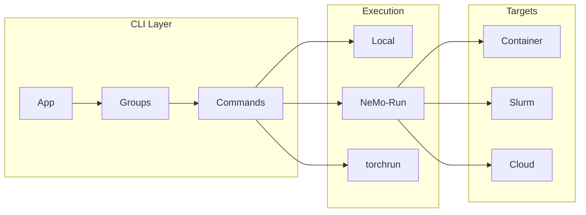

# CLI Framework

The `nemotron.kit` CLI framework provides tools for building hierarchical command-line interfaces for training recipes, with native integration with NeMo-Run for remote execution.

## Overview

The CLI framework enables:

- **Nested Commands** — Build hierarchical CLIs like `uv run nemotron nano3 data prep pretrain`
- **Config Integration** — Automatic config loading with CLI overrides
- **Artifact Resolution** — Map artifacts to config fields automatically
- **Remote Execution** — Submit jobs to Slurm, Docker, or cloud via NeMo-Run

For artifacts and configuration, see [kit.md](./kit.md). For execution profiles, see [nemo-run.md](./nemo-run.md).

## Architecture



## Building CLIs with App

### Basic Structure

```python
from nemotron.kit import App
from dataclasses import dataclass

@dataclass
class Stage1Config:
    blend_path: Path
    output_dir: Path
    num_shards: int = 128

def stage1_main(cfg: Stage1Config):
    # Implementation
    pass

# Create app with nested groups
app = App("myrecipe", description="My training recipe")
data = app.group("data", description="Data commands")
prep = data.group("prep", description="Data preparation")
prep.command("stage1", Stage1Config, stage1_main)
```

This creates the command structure:
```bash
uv run nemotron myrecipe data prep stage1 --blend-path ... --output-dir ...
```

### Command Registration

```python
from pathlib import Path

app.command(
    name="train",
    config_cls=TrainConfig,
    handler=train_main,
    script_path=Path(__file__),  # Required for NeMo-Run execution
    description="Run training",
)
```

**Parameters:**
| Parameter | Description |
|-----------|-------------|
| `name` | Command name |
| `config_cls` | Dataclass for configuration |
| `handler` | Function to call with config |
| `script_path` | Path to script (for remote execution) |
| `description` | Help text |
| `artifacts` | Artifact input mappings |

### Nested Groups

Create deeply nested command structures:

```python
app = App("nano3", description="Nano3 training recipe")

# Level 1: data
data = app.group("data", description="Data commands")

# Level 2: prep
prep = data.group("prep", description="Preparation commands")

# Level 3: commands
prep.command("pretrain", PretrainConfig, pretrain_main)
prep.command("sft", SFTConfig, sft_main)
prep.command("rl", RLConfig, rl_main)
```

Results in:
```bash
uv run nemotron nano3 data prep pretrain
uv run nemotron nano3 data prep sft
uv run nemotron nano3 data prep rl
```

## Artifact Inputs

### ArtifactInput

Map artifact metadata to config fields automatically:

```python
from nemotron.kit.cli.recipe import ArtifactInput

app.command(
    "train",
    TrainConfig,
    train_main,
    artifacts={
        "data": ArtifactInput(
            default_name="PretrainBlendsArtifact-default:latest",
            mappings={"path": "data_path"},
        ),
        "model": ArtifactInput(
            default_name="ModelArtifact-pretrain:latest",
            mappings={"path": "checkpoint_path"},
        ),
    },
)
```

**How it works:**
1. User can override with `--art.data <name:version>`
2. Kit resolves the artifact URI to a local path
3. The `mappings` inject artifact fields into config

### Artifact Resolution in Config

Use the `${art:...}` resolver in YAML configs:

```yaml
# config.yaml
run:
  data: PretrainBlendsArtifact-default:latest

recipe:
  per_split_data_args_path: ${art:data,path}/blend.json
```

The resolver:
1. Looks up `data` artifact from `run.data`
2. Extracts the `path` field
3. Substitutes into the config value

## Global Options

All commands automatically get these options:

| Option | Short | Description |
|--------|-------|-------------|
| `--config-file` | `-c` | Path to config file |
| `--run` | | Attached execution via NeMo-Run (waits for completion) |
| `--batch` | | Detached execution via NeMo-Run (submits and exits) |
| `--dry-run` | | Preview execution without running |
| `--art.<name>` | | Override artifact reference |

### Examples

```bash
# Use specific config
uv run nemotron nano3 pretrain -c config/tiny.yaml

# Submit to cluster (attached)
uv run nemotron nano3 pretrain --run MY-CLUSTER

# Submit to cluster (detached)
uv run nemotron nano3 pretrain --batch MY-CLUSTER

# Preview without executing
uv run nemotron nano3 pretrain --run MY-CLUSTER --dry-run

# Override artifact
uv run nemotron nano3 train --art.data PretrainBlendsArtifact-v2:latest

# Override config values
uv run nemotron nano3 pretrain -c tiny train.train_iters=5000
```

## Execution Modes

### Local Execution

Run directly on your machine:

```bash
# Via nemotron CLI
uv run nemotron nano3 data prep pretrain

# Direct Python execution
python data_prep.py --config config.yaml

# With overrides
python data_prep.py --config config.yaml num_shards=64
```

### NeMo-Run Integration

Submit jobs to remote executors:

```bash
# Attached: wait for completion, stream logs
uv run nemotron nano3 pretrain --run MY-CLUSTER

# Detached: submit and exit immediately
uv run nemotron nano3 pretrain --batch MY-CLUSTER
```

Configure profiles in `env.toml`:

```toml
[MY-CLUSTER]
executor = "slurm"
account = "my-account"
partition = "batch"
nodes = 2
gpus_per_node = 8
```

See [nemo-run.md](./nemo-run.md) for complete profile configuration.

### Direct Torchrun

For distributed training inside containers:

```bash
torchrun --nproc_per_node=8 \
    -m nemotron.recipes.nano3.stage0_pretrain.train \
    --config config/tiny.yaml
```

## Building a Recipe

### Step 1: Define Config Dataclass

```python
# config.py
from dataclasses import dataclass
from pathlib import Path

@dataclass
class DataPrepConfig:
    blend_path: Path
    output_dir: Path
    tokenizer_model: str = "nvidia/NVIDIA-Nemotron-Nano-9B-v2"
    num_shards: int = 128
    sample: int | None = None
    force: bool = False
```

### Step 2: Create Data Prep Script

```python
# data_prep.py
from nemotron.kit import PretrainBlendsArtifact, print_step_complete
from nemotron.kit.train_script import (
    parse_config_and_overrides,
    load_omegaconf_yaml,
    omegaconf_to_dataclass,
)

DEFAULT_CONFIG = Path(__file__).parent / "config/default.yaml"

def main(cfg: DataPrepConfig | None = None) -> PretrainBlendsArtifact:
    if cfg is None:
        config_path, overrides = parse_config_and_overrides(DEFAULT_CONFIG)
        config = load_omegaconf_yaml(config_path)
        cfg = omegaconf_to_dataclass(config, DataPrepConfig)

    # Process data...
    artifact = PretrainBlendsArtifact(
        path=cfg.output_dir,
        total_tokens=...,
        source_datasets=[...],
    )
    artifact.save(name="MyRecipe-data")

    print_step_complete(data_prep=artifact)
    return artifact

if __name__ == "__main__":
    main()
```

### Step 3: Create Training Script

```python
# train.py
from nemotron.kit import ModelArtifact
from nemotron.kit.train_script import parse_config_and_overrides

def main(cfg: TrainConfig | None = None) -> ModelArtifact:
    if cfg is None:
        # Load config from CLI
        ...

    # Run training...
    artifact = ModelArtifact(
        path=cfg.checkpoint_dir,
        loss=final_loss,
        step=final_step,
    )
    artifact.save(name="MyRecipe-model")
    return artifact
```

### Step 4: Wire Up CLI

```python
# __main__.py
from nemotron.kit import App
from nemotron.kit.cli.recipe import ArtifactInput

from .data_prep import main as data_prep_main, DataPrepConfig
from .train import main as train_main, TrainConfig

app = App("myrecipe", description="My training recipe")

# Data prep command
data = app.group("data")
prep = data.group("prep")
prep.command("run", DataPrepConfig, data_prep_main)

# Training command with artifact input
app.command(
    "train",
    TrainConfig,
    train_main,
    artifacts={
        "data": ArtifactInput(
            default_name="MyRecipe-data:latest",
            mappings={"path": "data_path"},
        ),
    },
)

if __name__ == "__main__":
    app.run()
```

### Step 5: Add Config Files

```yaml
# config/default.yaml
blend_path: ${oc.env:PWD}/data_blend.json
output_dir: ${oc.env:PWD}/output
tokenizer_model: nvidia/NVIDIA-Nemotron-Nano-9B-v2
num_shards: 128
```

```yaml
# config/tiny.yaml (for testing)
blend_path: ${oc.env:PWD}/data_blend.json
output_dir: ${oc.env:PWD}/output
num_shards: 4
sample: 1000
```

### Step 6: Run

```bash
# Test locally
uv run nemotron myrecipe data prep run -c tiny

# Run on cluster
uv run nemotron myrecipe train --run MY-CLUSTER
```

## API Reference

### App Builder

| Export | Description |
|--------|-------------|
| `App` | Main CLI builder class |
| `App.group()` | Create nested command group |
| `App.command()` | Register leaf command |
| `App.run()` | Execute CLI |

### Artifact Inputs

| Export | Description |
|--------|-------------|
| `ArtifactInput` | Define artifact-to-config mapping |
| `ArtifactInput.default_name` | Default artifact URI |
| `ArtifactInput.mappings` | Field-to-config mappings |

### Execution

| Export | Description |
|--------|-------------|
| `RunConfig` | NeMo-Run configuration |
| `build_executor()` | Create NeMo-Run executor |
| `load_run_profile()` | Load profile from env.toml |

## Further Reading

- [Kit Core](./kit.md) — Artifacts, configuration, lineage tracking
- [NeMo-Run Configuration](./nemo-run.md) — Execution profiles and env.toml
- [Data Preparation](./data-prep.md) — Data preparation module
- [Nano3 Recipe](./nano3/README.md) — Complete training recipe example
