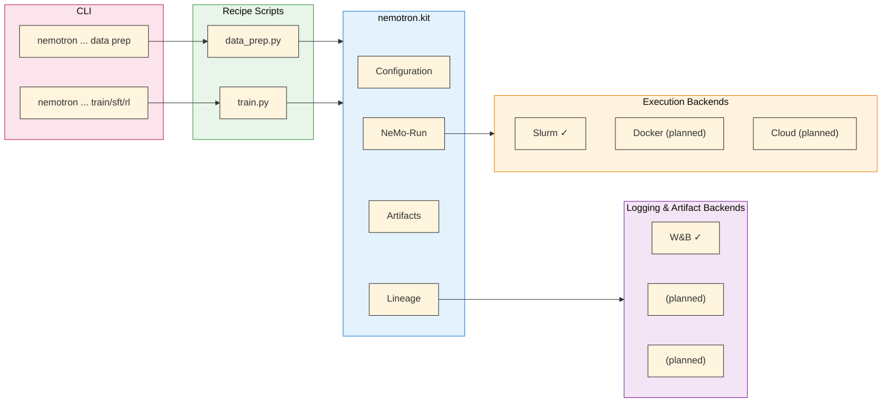

# Nemotron Kit

The `nemotron.kit` module is a lightweight framework powering Nemotron training recipes. It provides the infrastructure for building reproducible ML training pipelines with artifact versioning, configuration management, and lineage tracking.

> **Lightweight by Design**: Kit handles recipe orchestration—not training. All heavy lifting is done by the [NVIDIA AI Stack](./nvidia-stack.md): [Megatron-Core](https://github.com/NVIDIA/Megatron-LM) for distributed training primitives, [Megatron-Bridge](https://github.com/NVIDIA/Megatron-Bridge) for model training, and [NeMo-RL](https://github.com/NVIDIA/NeMo-RL) for reinforcement learning.

## Overview

Kit handles four core responsibilities:

| Component | Purpose |
|-----------|---------|
| **[Artifacts](./artifacts.md)** | Path-centric data and model versioning with typed metadata |
| **Configuration** | YAML/TOML config loading with Hydra-style overrides |
| **[CLI](./cli.md)** | Batteries-included CLI with optional MLOps execution via `--run` and `--batch` |
| **[Lineage](./artifacts.md)** | Experiment tracking and artifact provenance via [W&B](./wandb.md) |
| **[Execution](./nemo-run.md)** | Optional NeMo-Run integration for distributed training |

## Architecture



## Quick Example

A minimal training recipe using kit:

```python
from nemotron.kit import cli, PretrainBlendsArtifact
from dataclasses import dataclass
from pathlib import Path

@dataclass
class Config:
    data_path: Path
    output_dir: Path
    learning_rate: float = 1e-4

# Load config with CLI override support
config = cli(Config, config_file="config.yaml")

# Load data artifact
data = PretrainBlendsArtifact.load(config.data_path)
print(f"Training on {data.total_tokens:,} tokens")

# ... training code ...

# Save model artifact
model = ModelArtifact(path=config.output_dir, step=10000, loss=2.5)
model.save(name="ModelArtifact-pretrain")
```

Run with overrides:

```bash
python train.py --config config.yaml learning_rate=5e-5
```

## Key Concepts

### Artifacts

Artifacts are path-centric objects with typed metadata. The core field is always `path`—the filesystem location of the data. See [Artifact Lineage](./artifacts.md) for details.

```python
from nemotron.kit import PretrainBlendsArtifact

# Load from semantic URI
artifact = PretrainBlendsArtifact.from_uri("art://PretrainBlendsArtifact:latest")
print(f"Path: {artifact.path}")
print(f"Tokens: {artifact.total_tokens:,}")
```

### Configuration

Kit supports YAML, TOML, and JSON configs with automatic format detection and Hydra-style overrides:

```yaml
# config.yaml
data_path: /data/pretrain
output_dir: ${oc.env:PWD}/output
learning_rate: 1e-4
```

Override from CLI:

```bash
python train.py --config config.yaml output_dir=/scratch/output
```

### Execution

Kit integrates with [NeMo-Run](./nemo-run.md) for distributed execution across Slurm, Docker, and cloud environments:

```bash
# Run on Slurm cluster
uv run nemotron nano3 pretrain --run YOUR-CLUSTER

# Run in Docker
uv run nemotron nano3 pretrain --run docker-profile
```

### Lineage Tracking

Kit tracks artifact lineage through W&B. See [W&B Integration](./wandb.md) for automatic credential handling and [Artifact Lineage](./artifacts.md) for the lineage graph.

## Module Structure

```
nemotron.kit
├── artifacts        # Artifact classes and registry
├── cli              # CLI building and env.toml parsing
├── config           # Configuration loading
├── run              # NeMo-Run executor building
├── trackers         # Lineage tracking backends
└── wandb            # W&B integration utilities
```

## API Reference

### Artifacts

| Export | Description |
|--------|-------------|
| `Artifact` | Base artifact class |
| `PretrainBlendsArtifact` | Pretrain data with train/valid/test splits |
| `SFTDataArtifact` | Packed SFT sequences |
| `SplitJsonlDataArtifact` | RL JSONL data |
| `ModelArtifact` | Model checkpoints |
| `InputDatasetInfo` | Source dataset metadata |

### Configuration

| Export | Description |
|--------|-------------|
| `cli()` | Config loader with CLI support |
| `load_omegaconf_yaml()` | Load YAML with OmegaConf |
| `apply_hydra_overrides()` | Apply key=value overrides |

### Execution

| Export | Description |
|--------|-------------|
| `build_executor()` | Build NeMo-Run executor from profile |
| `load_env_profile()` | Load execution profile from env.toml |

### Tracking

| Export | Description |
|--------|-------------|
| `init_wandb_if_configured()` | Conditional W&B initialization |
| `add_wandb_tags()` | Add tags to W&B runs |
| `finish_wandb()` | Clean W&B shutdown |

## Further Reading

- [NVIDIA AI Stack](./nvidia-stack.md) — Megatron-Core, Megatron-Bridge, NeMo-RL
- [OmegaConf Configuration](./omegaconf.md) — Artifact interpolations and unified W&B logging
- [Artifact Lineage](./artifacts.md) — Artifact versioning and W&B lineage
- [W&B Integration](./wandb.md) — Automatic credential handling
- [Execution through NeMo-Run](./nemo-run.md) — Execution profiles and packagers
- [CLI Framework](./cli.md) — Building recipe CLIs
- [Data Preparation](./data-prep.md) — Data prep module
