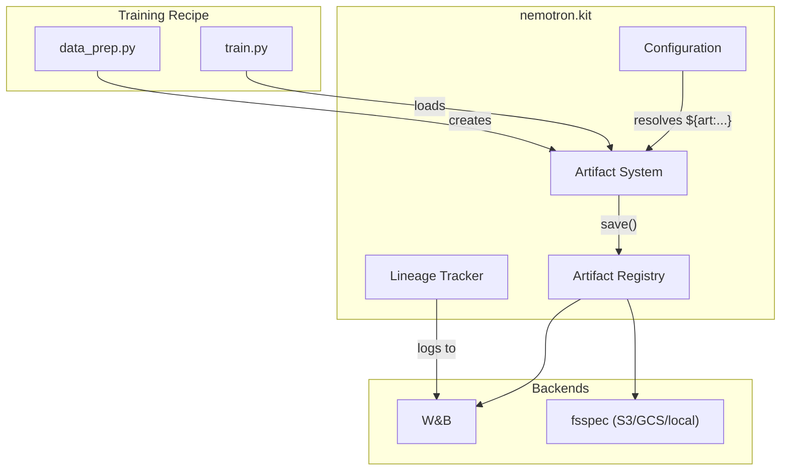

# Nemotron Kit

The `nemotron.kit` module is a training recipe framework that provides artifact versioning, configuration management, and lineage tracking for reproducible ML training pipelines.

## Overview

Kit provides the core infrastructure for building training recipes:

- **Artifacts** — Path-centric data and model versioning with typed metadata
- **Configuration** — YAML/TOML/JSON config loading with OmegaConf and Hydra-style overrides
- **Lineage Tracking** — W&B integration for experiment tracking and artifact provenance
- **Registry** — Multi-backend artifact storage (fsspec for local/S3/GCS, W&B for collaboration)

For CLI building and execution, see [cli.md](./cli.md). For execution profiles, see [nemo-run.md](./nemo-run.md).

## Architecture



## Artifacts

### Philosophy: "An artifact IS a path"

Artifacts are path-centric objects with typed metadata. The core field is always `path` — the filesystem location of the data. Metadata provides additional context for reproducibility and lineage.

```python
from nemotron.kit import PretrainBlendsArtifact

# An artifact is fundamentally a path with metadata
artifact = PretrainBlendsArtifact(
    path=Path("/output/pretrain/data"),
    total_tokens=25_000_000_000,
    source_datasets=[...],
)
```

### Semantic URIs

Artifacts can be referenced by semantic URIs:

```
art://my-dataset:latest      # Latest version
art://my-dataset:v3          # Specific version
art://my-model:production    # Alias
```

### Built-in Artifact Types

| Class | Use Case | Key Fields |
|-------|----------|------------|
| `Artifact` | Base class | `path`, `metadata` |
| `DataBlendsArtifact` | Tokenized data | `total_tokens`, `source_datasets`, `tokenizer_uri` |
| `PretrainBlendsArtifact` | Pretrain with splits | + `train_path`, `valid_path`, `test_path` |
| `SFTDataArtifact` | Packed SFT data | + `pack_size`, `training_path`, `validation_path` |
| `SplitJsonlDataArtifact` | RL JSONL splits | + `train_path`, `valid_path`, `test_path` |
| `ModelArtifact` | Model checkpoints | `loss`, `step`, `metrics` |

### Creating Artifacts

```python
from nemotron.kit import PretrainBlendsArtifact, InputDatasetInfo
from pathlib import Path

# Track source datasets for lineage
source_datasets = [
    InputDatasetInfo(
        uri="hf://EleutherAI/pile",
        name="pile",
        split="train",
        num_rows=210_000_000,
    ),
]

# Create artifact with typed metadata
artifact = PretrainBlendsArtifact(
    path=Path("/output/pretrain/data"),
    total_tokens=25_000_000_000,
    total_sequences=6_000_000,
    source_datasets=source_datasets,
    tokenizer_uri="hf://nvidia/NVIDIA-Nemotron-Nano-9B-v2",
)

# Save to registry with semantic name
artifact.save(name="PretrainBlendsArtifact-default")
```

### Loading Artifacts

```python
from nemotron.kit import PretrainBlendsArtifact

# From local path
artifact = PretrainBlendsArtifact.load(Path("/output/data"))

# From semantic URI
artifact = PretrainBlendsArtifact.from_uri("art://PretrainBlendsArtifact-default:latest")

# From stdin (for piping between steps)
artifact = PretrainBlendsArtifact.load()  # Reads JSON from stdin
```

### Artifact Registry

The registry manages artifact versions and storage:

```python
from nemotron.kit import init, get_config

# Initialize with W&B backend
init(backend="wandb")

# Or use fsspec for local/cloud storage
init(backend="fsspec", registry_path="/path/to/registry")
```

**Backends:**
- `wandb` — W&B artifact system with full lineage tracking
- `fsspec` — Local filesystem, S3, GCS, or any fsspec-compatible storage

## Configuration

### Supported Formats

Kit supports YAML, TOML, and JSON configuration files with automatic format detection:

```yaml
# config.yaml
blend_path: ${oc.env:PWD}/data_blend.json
output_dir: ${oc.env:PWD}/output
tokenizer_model: nvidia/NVIDIA-Nemotron-Nano-9B-v2
num_shards: 128
```

### Config Loading

```python
from nemotron.kit import cli
from dataclasses import dataclass

@dataclass
class MyConfig:
    blend_path: Path
    output_dir: Path
    tokenizer_model: str = "nvidia/NVIDIA-Nemotron-Nano-9B-v2"
    num_shards: int = 128

# Load config with CLI override support
config = cli(MyConfig, config_file="config.yaml")
```

### Hydra-Style Overrides

Override config values from the command line:

```bash
python my_script.py --config config.yaml num_shards=256 tokenizer_model=meta-llama/Llama-3.2-1B
```

### Custom Resolvers

Kit registers OmegaConf resolvers for dynamic value resolution:

| Resolver | Description | Example |
|----------|-------------|---------|
| `${oc.env:VAR}` | Environment variable | `${oc.env:PWD}/output` |
| `${art:name,field}` | Artifact field | `${art:data,path}/blend.json` |

### Training Script Utilities

For training scripts that need more control:

```python
from nemotron.kit.train_script import (
    parse_config_and_overrides,
    load_omegaconf_yaml,
    apply_hydra_overrides,
    omegaconf_to_dataclass,
)

# Parse --config and CLI overrides
config_path, overrides = parse_config_and_overrides(
    default_config=Path("config/default.yaml")
)

# Load and apply overrides
config = load_omegaconf_yaml(config_path)
config = apply_hydra_overrides(config, overrides)

# Convert to typed dataclass
cfg = omegaconf_to_dataclass(config, MyConfig)
```

## Lineage Tracking

### W&B Integration

Kit integrates with Weights & Biases for experiment tracking and artifact lineage:

```python
from nemotron.kit import (
    init_wandb_if_configured,
    add_wandb_tags,
    finish_wandb,
)

# Initialize W&B if configured
init_wandb_if_configured()

# Add tags for organization
add_wandb_tags(["data-prep", "pretrain", "nano3"])

# ... do work ...

# Clean shutdown
finish_wandb(exit_code=0)
```

### InputDatasetInfo

Track source datasets for full lineage:

```python
from nemotron.kit import InputDatasetInfo

source = InputDatasetInfo(
    uri="hf://nvidia/OpenMathReasoning",
    name="OpenMathReasoning",
    split="train",
    subset=None,
    weight=1.0,
    num_rows=1_500_000,
    size_bytes=2_500_000_000,
)
```

When included in an artifact's `source_datasets`, W&B automatically tracks the lineage graph.

### Tracker API

For custom tracking implementations:

```python
from nemotron.kit import LineageTracker, set_lineage_tracker, get_lineage_tracker

# Get active tracker
tracker = get_lineage_tracker()

if tracker.is_active():
    run_id = tracker.get_run_id()
    tracker.log_artifact(artifact, name="my-artifact", used_artifacts=[])
```

## API Reference

### Artifacts

| Export | Description |
|--------|-------------|
| `Artifact` | Base artifact class |
| `DataBlendsArtifact` | Tokenized data blends |
| `PretrainBlendsArtifact` | Pretrain-specific data with splits |
| `SFTDataArtifact` | Supervised fine-tuning data |
| `SplitJsonlDataArtifact` | Train/valid/test JSONL splits |
| `ModelArtifact` | Model checkpoints |
| `InputDatasetInfo` | Source dataset metadata for lineage |
| `TrackingInfo` | Tracking metadata |

### Configuration

| Export | Description |
|--------|-------------|
| `cli()` | Config loader with CLI support |
| `ConfigManager` | Config file management |
| `parse_config_and_overrides()` | Parse --config and overrides |
| `load_omegaconf_yaml()` | Load YAML with OmegaConf |
| `apply_hydra_overrides()` | Apply key=value overrides |
| `omegaconf_to_dataclass()` | Convert to typed dataclass |

### Registry

| Export | Description |
|--------|-------------|
| `init()` | Initialize kit with backend |
| `get_config()` | Get kit configuration |
| `is_initialized()` | Check initialization status |
| `ArtifactRegistry` | Registry interface |
| `ArtifactEntry` | Versioning metadata |
| `ArtifactVersion` | Individual version info |

### Tracking

| Export | Description |
|--------|-------------|
| `LineageTracker` | Tracker protocol |
| `WandbTracker` | W&B implementation |
| `NoOpTracker` | No-operation tracker |
| `set_lineage_tracker()` | Register tracker |
| `get_lineage_tracker()` | Get active tracker |
| `add_wandb_tags()` | Add tags to runs |
| `finish_wandb()` | Clean W&B shutdown |
| `init_wandb_if_configured()` | Conditional W&B init |

### Utilities

| Export | Description |
|--------|-------------|
| `print_step_complete()` | Format completion messages |
| `to_wandb_uri()` | Convert to W&B URI format |
| `tokenizer_to_uri()` | Create tokenizer URIs |

## Further Reading

- [CLI Framework](./cli.md) — Building recipe CLIs and execution modes
- [NeMo-Run Configuration](./nemo-run.md) — Execution profiles and env.toml
- [Data Preparation](./data-prep.md) — Data preparation module
- [Nano3 Recipe](./nano3/README.md) — Complete training recipe example
