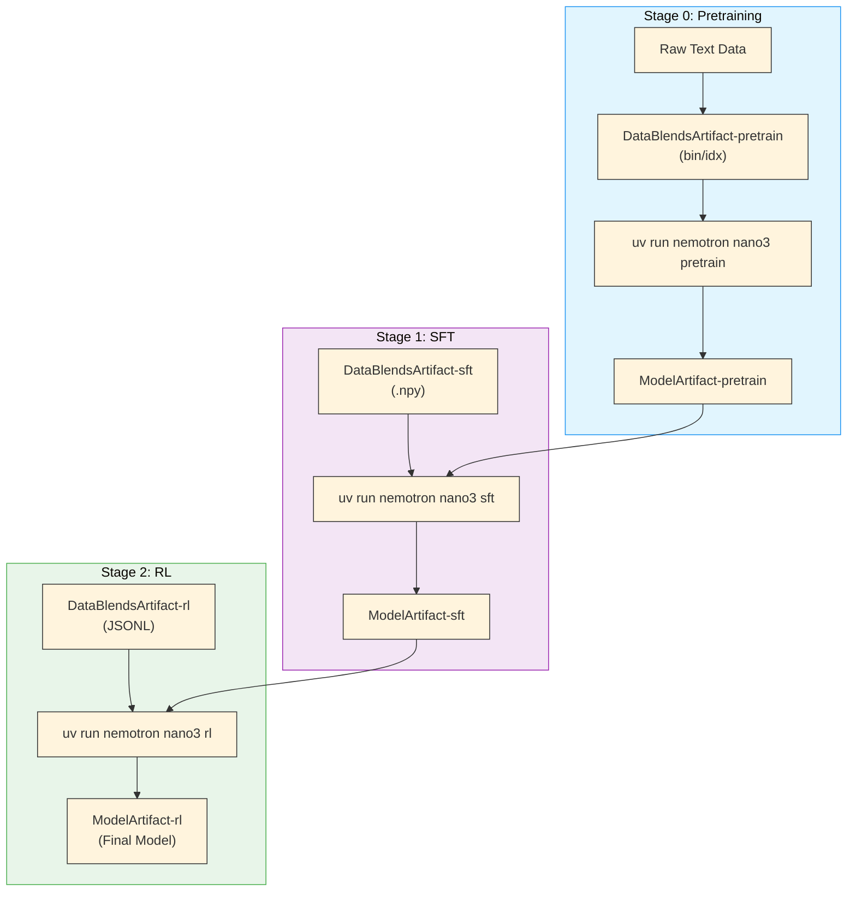

# Nemotron 3 Nano Training Recipe

A complete, reproducible training pipeline for Nemotron 3 Nano—an open, efficient Mixture-of-Experts hybrid Mamba-Transformer model optimized for agentic reasoning.

## Quick Start

### Prerequisites

- **Slurm cluster** with GPU nodes (H100 recommended) — see [Execution through NeMo-Run](../nemo-run.md)
- **[Weights & Biases](../wandb.md) account** for experiment tracking and [artifact lineage](../artifacts.md)
- **Container images**:
  - Training: `nvcr.io/nvidia/nemo:25.11.nemotron_3_nano`
  - RL: `nvcr.io/nvidia/nemo-rl:v0.4.0.nemotron_3_nano`

### Installation

```bash
git clone https://github.com/NVIDIA/nemotron
cd nemotron
uv sync
```

### Configuration

Create an `env.toml` file (see [Execution through NeMo-Run](../nemo-run.md) for details):

```toml
[wandb]
project = "nemotron"
entity = "YOUR-TEAM"

[YOUR-CLUSTER]
executor = "slurm"
account = "YOUR-ACCOUNT"
partition = "batch"
nodes = 2
ntasks_per_node = 8
gpus_per_node = 8
mounts = ["/lustre:/lustre"]
```

### Run the Pipeline

<div class="termy">

```console
// Stage 0: Pretraining
$ uv run nemotron nano3 data prep pretrain --run YOUR-CLUSTER
$ uv run nemotron nano3 pretrain --run YOUR-CLUSTER

// Stage 1: Supervised Fine-Tuning
$ uv run nemotron nano3 data prep sft --run YOUR-CLUSTER
$ uv run nemotron nano3 sft --run YOUR-CLUSTER

// Stage 2: Reinforcement Learning
$ uv run nemotron nano3 data prep rl --run YOUR-CLUSTER
$ uv run nemotron nano3 rl --run YOUR-CLUSTER
```

</div>

## Resources

- **Tech Report**: [Nemotron 3 Nano Technical Report](https://research.nvidia.com/labs/nemotron/files/NVIDIA-Nemotron-3-Nano-Technical-Report.pdf)
- **Model Weights**:
  - [NVIDIA-Nemotron-3-Nano-30B-A3B-Base-BF16](https://huggingface.co/nvidia/NVIDIA-Nemotron-3-Nano-30B-A3B-Base-BF16) (Base model)
  - [NVIDIA-Nemotron-3-Nano-30B-A3B-BF16](https://huggingface.co/nvidia/NVIDIA-Nemotron-3-Nano-30B-A3B-BF16) (Instruct model)
  - [NVIDIA-Nemotron-3-Nano-30B-A3B-FP8](https://huggingface.co/nvidia/NVIDIA-Nemotron-3-Nano-30B-A3B-FP8) (FP8 quantized)
- **Model Collection**: [NVIDIA Nemotron v3 Collection](https://huggingface.co/collections/nvidia/nvidia-nemotron-v3)
- **Training Datasets**:
  - [Pre-training Datasets](https://huggingface.co/collections/nvidia/nemotron-pre-training-datasets) (Open pre-training data)
  - [Post-training Datasets](https://huggingface.co/collections/nvidia/nemotron-post-training-v3) (SFT and RL data)

## Training Pipeline

| Stage | Name | Purpose | Guide |
|-------|------|---------|-------|
| 0 | [Pretraining](./pretrain.md) | Base model on 25T tokens with curriculum learning | [pretrain.md](./pretrain.md) |
| 1 | [SFT](./sft.md) | Multi-domain instruction tuning with 12+ data sources | [sft.md](./sft.md) |
| 2 | [RL](./rl.md) | GRPO alignment with multi-environment rewards | [rl.md](./rl.md) |

## Model Specifications

| Specification | Value |
|---------------|-------|
| **Total Parameters** | 31.6B |
| **Active Parameters** | 3.6B (per forward pass) |
| **Pretraining Tokens** | 25 trillion |
| **Context Length** | Up to 1M tokens |
| **Architecture** | Hybrid Mamba-Transformer with sparse MoE |

> For architecture details, see [Tech Report Section 2.1](https://research.nvidia.com/labs/nemotron/files/NVIDIA-Nemotron-3-Nano-Technical-Report.pdf).

## Stage Summaries

### Stage 0: Pretraining

Two-phase curriculum on 25 trillion tokens: Phase 1 (23.5T) focuses on diversity across web, code, math, and multilingual data; Phase 2 (1.5T) emphasizes high-quality sources. Includes long-context extension to 1M tokens.

→ [Pretraining Guide](./pretrain.md)

### Stage 1: Supervised Fine-Tuning

Multi-domain instruction tuning covering 12+ data domains including competition math/code, InfinityByte cross-domain synthesis, STEM reasoning, conversational tool use, and multilingual support.

→ [SFT Guide](./sft.md)

### Stage 2: Reinforcement Learning

Multi-environment RLVR training across 7 reward environments using GRPO, plus GenRM-based RLHF and DPO for reducing tool hallucination.

→ [RL Guide](./rl.md)

## Execution Options

All commands support [NeMo-Run](../nemo-run.md) execution modes:

| Option | Behavior | Use Case |
|--------|----------|----------|
| `--run <profile>` | Attached—submits job and streams logs | Interactive development |
| `--batch <profile>` | Detached—submits and exits immediately | Long-running jobs |
| `--dry-run` | Preview execution plan | Validation |

See [Execution through NeMo-Run](../nemo-run.md) for profile configuration and advanced options.

## Artifact Lineage

The pipeline tracks full lineage via [W&B Artifacts](../artifacts.md), enabling traceability from raw data to final model.



→ [Artifact Lineage & W&B Integration](../artifacts.md)

## Open-Source Data

> **Note**: These recipes train exclusively on the open-sourced subset of training data. Results will differ from the tech report benchmarks, which used additional proprietary data. Use these recipes as reference implementations to apply the methodology with your own data.

## Coming Soon

Native integrations with NVIDIA's NeMo ecosystem:

| Tool | Description | Status |
|------|-------------|--------|
| [NeMo Curator](https://github.com/NVIDIA-NeMo/Curator) | Scalable data curation—deduplication, quality filtering, PII removal | Planned |
| [NeMo Data Designer](https://github.com/NVIDIA-NeMo/DataDesigner) | Synthetic data generation for instruction tuning and alignment | Planned |
| [NeMo Export-Deploy](https://github.com/NVIDIA-NeMo/Export-Deploy) | Model export to TensorRT-LLM and deployment | Planned |
| [NeMo Evaluator](https://github.com/NVIDIA-NeMo/Evaluator) | Comprehensive model evaluation and benchmarking | Planned |

These integrations will enable end-to-end pipelines from data curation to model evaluation.

## CLI Reference

<div class="termy">

```console
// Show available commands
$ uv run nemotron nano3 --help
Usage: nemotron nano3 [OPTIONS] COMMAND [ARGS]...

 Nano3 training recipe

╭─ Commands ───────────────────────────────────────────────────────────────╮
│ data       Data curation and preparation commands                        │
│ model      Model evaluation and import commands                          │
╰──────────────────────────────────────────────────────────────────────────╯
╭─ Training Stages ────────────────────────────────────────────────────────╮
│ pretrain   Run pretraining with Megatron-Bridge (stage0).                │
│ sft        Run supervised fine-tuning with Megatron-Bridge (stage1).     │
│ rl         Run reinforcement learning with NeMo-RL GRPO (stage2).        │
╰──────────────────────────────────────────────────────────────────────────╯

// View training command help (SFT example with artifact overrides)
$ uv run nemotron nano3 sft --help
Usage: nemotron nano3 sft [OPTIONS]

 Run supervised fine-tuning with Megatron-Bridge (stage1).

╭─ Options ────────────────────────────────────────────────────────────────╮
│ --help  -h        Show this message and exit.                            │
╰──────────────────────────────────────────────────────────────────────────╯
╭─ Global Options ─────────────────────────────────────────────────────────╮
│  -c, --config NAME       Config name or path                             │
│  -r, --run PROFILE       Submit to cluster (attached)                    │
│  -b, --batch PROFILE     Submit to cluster (detached)                    │
│  -d, --dry-run           Preview config without execution                │
│  --stage                 Stage files for interactive debugging           │
╰──────────────────────────────────────────────────────────────────────────╯
╭─ Configs (-c/--config) ──────────────────────────────────────────────────╮
│ Built-in: default, tiny                                                  │
│ Custom: -c /path/to/your/config.yaml                                     │
╰──────────────────────────────────────────────────────────────────────────╯
╭─ Artifact Overrides (W&B artifact references) ───────────────────────────╮
│  run.model     Base model checkpoint artifact                            │
│  run.data      SFT data artifact (packed .npy)                           │
╰──────────────────────────────────────────────────────────────────────────╯
╭─ Run Overrides (override env.toml settings) ─────────────────────────────╮
│  run.env.nodes               Number of nodes                             │
│  run.env.nproc_per_node      GPUs per node                               │
│  run.env.partition           Slurm partition                             │
│  run.env.account             Slurm account                               │
│  run.env.time                Job time limit (e.g., 04:00:00)             │
│  run.env.container_image     Override container image                    │
╰──────────────────────────────────────────────────────────────────────────╯
╭─ env.toml Profiles ──────────────────────────────────────────────────────╮
│ Available profiles: YOUR-CLUSTER, YOUR-CLUSTER-large                     │
│ Usage: --run PROFILE or --batch PROFILE                                  │
╰──────────────────────────────────────────────────────────────────────────╯
╭─ Examples ───────────────────────────────────────────────────────────────╮
│ $ ... sft -c tiny                    Local execution                     │
│ $ ... sft -c tiny --dry-run          Preview config                      │
│ $ ... sft -c tiny --run my-cluster   Submit to cluster                   │
│ $ ... sft -c tiny -r cluster run.env.nodes=4                             │
╰──────────────────────────────────────────────────────────────────────────╯
```

</div>

## Troubleshooting

**W&B authentication**: See [W&B Integration](../wandb.md) for setup.
```bash
wandb login
```

**Container not found**: Verify image path in config files.

**Job submission fails**: Check Slurm account and partition in `env.toml`. See [Execution through NeMo-Run](../nemo-run.md).

## Further Reading

- [Stage 0: Pretraining](./pretrain.md)
- [Stage 1: SFT](./sft.md)
- [Stage 2: RL](./rl.md)
- [Importing Models & Data](./import.md)
- [Artifact Lineage](../artifacts.md)
- [Execution through NeMo-Run](../nemo-run.md)
- [W&B Integration](../wandb.md)
- [NVIDIA AI Stack](../nvidia-stack.md)
- [CLI Framework](../cli.md)
- [Data Preparation Module](../data-prep.md)
