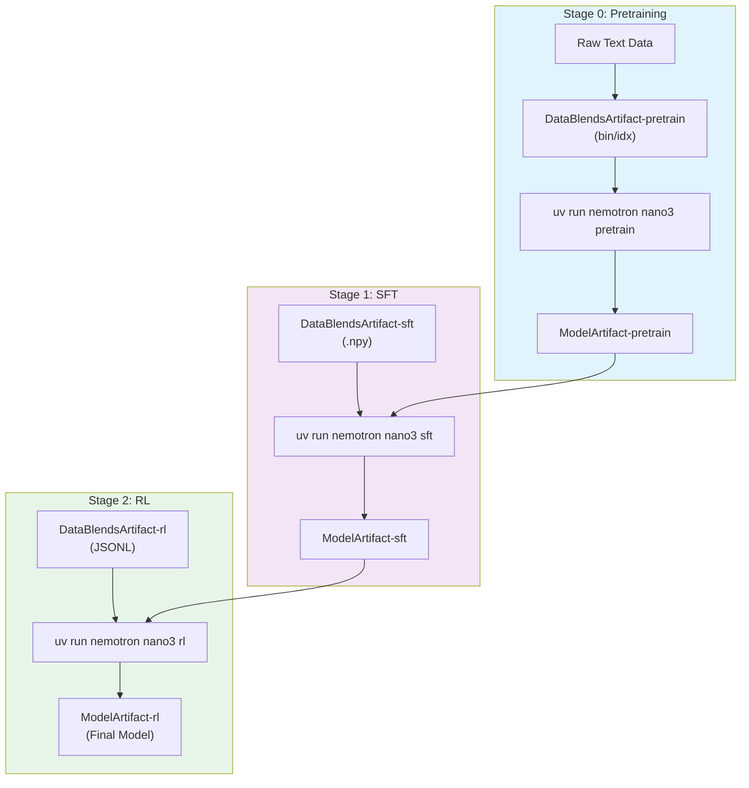

# Nemotron 3 Nano Training Recipe

This recipe provides a complete, reproducible training pipeline for Nemotron 3 Nano—an open, efficient Mixture-of-Experts hybrid Mamba-Transformer model optimized for agentic reasoning.

## Why Complete Training Pipelines

Training a production model involves interconnected components where isolated examples miss critical interactions between stages. This recipe shows the complete journey from raw data to deployment-ready model, demonstrating:

- **How data quality affects downstream performance** across pretraining, SFT, and RL stages
- **Which training techniques work together** in practice, not just theory
- **Where validation gates prevent failures** and ensure reproducibility
- **How to balance competing objectives** across the three training stages

Because this is a complete system, practitioners can extract specific techniques with confidence. Each component has been proven to work in a production context.

### What You Can Extract

This recipe provides battle-tested implementations of:

| Technique | Description | Stage |
|-----------|-------------|-------|
| **Curriculum-based pretraining** | Two-phase data mixture with quality-based weighting | Pretrain |
| **Long-context extension** | CPT methodology for extending to 1M context | Pretrain |
| **Multi-domain SFT** | 12+ data domains with chat templates and role-based loss masking | SFT |
| **InfinityByte code synthesis** | Cross-domain competitive coding data generation | SFT |
| **Tool-calling fine-tuning** | Recovery of tool-use capabilities post-SFT | SFT |
| **Budget-controlled reasoning** | Truncated reasoning traces for controllable compute | SFT/RL |
| **Multi-environment RLVR** | Simultaneous training across 7 reward environments | RL |
| **GenRM reward modeling** | Generative reward model with circular comparison | RL |
| **DPO for tool hallucination** | Reducing spurious tool calls through preference learning | RL |

> **Open-Source Data Only**: These recipes train exclusively on the open-sourced subset of training data. Results will differ from the tech report benchmarks, which used additional proprietary data. Use these recipes as reference implementations to apply the methodology with your own data.

## Model Overview

Nemotron 3 Nano achieves better or on-par accuracy than competitive models while having up to 3.3x higher inference throughput. The model demonstrates enhanced agentic, reasoning, and chat abilities with support for extended context lengths up to 1M tokens.

### Specifications

| Specification | Value |
|---------------|-------|
| **Total Parameters** | 31.6B |
| **Active Parameters** | 3.6B (per forward pass) |
| **Pretraining Tokens** | 25 trillion |
| **Context Length** | Up to 1M tokens |
| **Architecture** | Hybrid Mamba-Transformer with sparse MoE |

### Architecture Details

The model uses a hybrid Mamba-Transformer architecture with sparse Mixture-of-Experts layers replacing standard FFN layers. This design achieves better accuracy at a fraction of the active parameter count through granular MoE architectures with shared experts.

| Component | Value |
|-----------|-------|
| Num Layers | 32 |
| Model Dimension | 3008 |
| Q-heads | 32 |
| K/V-heads | 8 |
| Head Dimension | 128 |
| Mamba State Dimension | 128 |
| Mamba Groups | 8 |
| Mamba Heads | 64 |
| Mamba Head Dimension | 64 |
| Expert Dimension | 1856 |
| Total Routable Experts | 128 |
| Num Activated Experts | 6 |
| Shared Experts | 2 |

The MoE layers use DeepSeek's aux-loss-free load balancing strategy with an update rate of 1e-3 and a load balancing loss coefficient of 1e-4.

### Resources

- **Tech Report**: [Nemotron 3 Nano: Open, Efficient Mixture-of-Experts Hybrid Mamba-Transformer Model for Agentic Reasoning](https://arxiv.org/abs/2506.XXXXX)
- **Model Weights**:
  - [NVIDIA-Nemotron-3-Nano-30B-A3B-Base-BF16](https://huggingface.co/nvidia/NVIDIA-Nemotron-3-Nano-30B-A3B-Base-BF16) (Base model)
  - [NVIDIA-Nemotron-3-Nano-30B-A3B-BF16](https://huggingface.co/nvidia/NVIDIA-Nemotron-3-Nano-30B-A3B-BF16) (Instruct model)
  - [NVIDIA-Nemotron-3-Nano-30B-A3B-FP8](https://huggingface.co/nvidia/NVIDIA-Nemotron-3-Nano-30B-A3B-FP8) (FP8 quantized)
- **Model Collection**: [NVIDIA Nemotron v3 Collection](https://huggingface.co/collections/nvidia/nvidia-nemotron-v3)

## Training Pipeline

The training proceeds in three stages, each building on the previous with full lineage tracking:

| Stage | Name | Purpose | Framework | Guide |
|-------|------|---------|-----------|-------|
| 0 | [Pretraining](./pretrain.md) | Base model on 25T tokens with curriculum learning | Megatron-Bridge | [pretrain.md](./pretrain.md) |
| 1 | [SFT](./sft.md) | Multi-domain instruction tuning with 12+ data sources | Megatron-Bridge | [sft.md](./sft.md) |
| 2 | [RL](./rl.md) | GRPO alignment with multi-environment rewards | NeMo-RL | [rl.md](./rl.md) |

### Stage 0: Pretraining

Pretraining uses a two-phase curriculum on 25 trillion tokens:

- **Phase 1**: High diversity with 23.5T tokens across web, code, math, and multilingual data
- **Phase 2**: Quality-focused with 1.5T tokens prioritizing high-quality sources

The long-context phase (LC-Phase) extends context to 1M tokens using 121B additional tokens with 8-way context/tensor/expert parallelism on H100 GPUs.

### Stage 1: Supervised Fine-Tuning

SFT covers 12+ data domains using improved techniques over Nemotron Nano 2:

- **Competition math and code** with tool-integrated reasoning
- **InfinityByte** cross-domain code synthesis
- **Synthetic STEM reasoning** via the RQA dataset
- **Conversational tool use** with multi-turn trajectories
- **Long context** with 256k token examples
- **Formal proofs** using Lean theorem proving
- **Multilingual** coverage across 5 target languages

Data filtering removes malformed examples, pathological repetitions, and outputs with political/nationalistic narratives.

### Stage 2: Reinforcement Learning

Post-training includes three RL methodologies:

1. **RLVR (RL from Verifiable Rewards)** - Unified training across 7 environments simultaneously using GRPO with curriculum sampling
2. **RLHF with GenRM** - Generative reward model with circular comparison strategy and length-normalized reward adjustment
3. **DPO for tool hallucination** - Preference learning to reduce spurious tool calls (improves AIME25 accuracy from 80.88% to 84.58%)

## NVIDIA AI Stack

This pipeline leverages production-grade components from the NVIDIA AI Stack:

| Component | Purpose | Used In |
|-----------|---------|---------|
| **[NeMo Curator](https://github.com/NVIDIA/NeMo-Curator)** | Data curation at 100TB+ scale | Pretraining data *(coming soon)* |
| **[Megatron-Core + Bridge](https://github.com/NVIDIA/Megatron-LM)** | Distributed training with advanced parallelism | Stage 0, Stage 1 |
| **[NeMo-RL](https://github.com/NVIDIA/NeMo-RL)** | SFT, DPO, PPO, GRPO alignment | Stage 2 |
| **[ModelOpt](https://github.com/NVIDIA/TensorRT-Model-Optimizer)** | Pruning, quantization, distillation | Optimization *(coming soon)* |
| **[NeMo-Eval](https://github.com/NVIDIA/NeMo-Eval)** | Comprehensive benchmark evaluation | Evaluation *(coming soon)* |
| **[NeMo-Run](https://github.com/NVIDIA/NeMo-Run)** | Job orchestration across Slurm, Docker, cloud | All stages |

## Prerequisites

### Requirements (v0)

> **Slurm Only**: This initial release has been tested exclusively with Slurm execution. Support for additional NeMo-Run executors (local, Docker, SkyPilot, DGX Cloud) is planned for future releases.

- **Slurm cluster** with GPU nodes (H100 recommended)
- **Weights & Biases account** for experiment tracking and artifact lineage
- **Container images**:
  - Data prep: `anyscale/ray:2.49.2-py311`
  - Training: `nvcr.io/nvidian/nemo:25.11-nano-v3.rc2`
  - RL: NeMo-RL container

> Future versions will also support configurable artifact backends beyond W&B.

### Installation

```bash
# Clone the repository
git clone <repository-url>
cd nemotron

# Install with uv (recommended)
uv sync

# Or with pip
uv pip install -e .
```

## Configuration

Create an `env.toml` file to configure execution profiles:

```toml
# Weights & Biases configuration
[wandb]
project = "nemotron"
entity = "YOUR-TEAM"

# CLI display settings
[cli]
theme = "github-light"

# Cluster execution profile
[YOUR-CLUSTER]
executor = "slurm"
account = "YOUR-ACCOUNT"
partition = "batch"
nodes = 2
ntasks_per_node = 8
gpus_per_node = 8
mem = "0"
exclusive = true
mounts = ["/lustre:/lustre"]
```

Container images are specified in recipe config files (e.g., `config/tiny.yaml`), not in env.toml. See [nemo-run.md](../nemo-run.md) for complete configuration options.

## Quick Start

### Testing with Tiny Config

Validate the setup with the `tiny` configuration before running full-scale training:

```bash
# Test data preparation
uv run nemotron nano3 data prep pretrain --run YOUR-CLUSTER --sample 1000

# Test training (small model, few iterations)
uv run nemotron nano3 pretrain -c tiny --run YOUR-CLUSTER
```

### Full Training Pipeline

```bash
# Stage 0: Pretraining
uv run nemotron nano3 data prep pretrain --run YOUR-CLUSTER
uv run nemotron nano3 pretrain --run YOUR-CLUSTER

# Stage 1: Supervised Fine-Tuning
uv run nemotron nano3 data prep sft --run YOUR-CLUSTER
uv run nemotron nano3 sft --run YOUR-CLUSTER

# Stage 2: Reinforcement Learning
uv run nemotron nano3 data prep rl --run YOUR-CLUSTER
uv run nemotron nano3 rl --run YOUR-CLUSTER
```

## Execution Methods

### CLI Execution (Recommended)

The `nemotron` CLI integrates with NeMo-Run for execution across Slurm, local, Docker, and cloud backends.

| Option | Behavior | Use Case |
|--------|----------|----------|
| `--run <profile>` | Attached—submits job and streams logs | Interactive development, debugging |
| `--batch <profile>` | Detached—submits and exits immediately | Long-running jobs, queued execution |

```bash
# Attached: wait for completion, stream logs
uv run nemotron nano3 pretrain -c tiny --run YOUR-CLUSTER

# Detached: submit and return immediately
uv run nemotron nano3 pretrain -c tiny --batch YOUR-CLUSTER

# Preview without execution
uv run nemotron nano3 pretrain -c tiny --run YOUR-CLUSTER --dry-run
```

### Direct Script Execution

For debugging inside a container on a compute node:

```bash
cd src/nemotron/recipes/nano3/stage0_pretrain

# Data prep
uv run python data_prep.py --config config/data_prep.yaml

# Single-node training
uv run python train.py --config config/tiny.yaml

# Distributed training
uv run torchrun --nproc_per_node=8 train.py --config config/tiny.yaml
```

## Artifact Lineage

The pipeline tracks full lineage via W&B Artifacts:



Each artifact links automatically when running stages in sequence, providing full traceability from raw data to final model.

## CLI Reference

### Data Preparation

```bash
uv run nemotron nano3 data prep pretrain [--run <profile>] [--sample N] [--force]
uv run nemotron nano3 data prep sft [--run <profile>] [--sample N] [--force]
uv run nemotron nano3 data prep rl [--run <profile>] [--sample N] [--force]
```

### Training

```bash
uv run nemotron nano3 pretrain [--run|--batch <profile>] [-c <config>] [overrides...]
uv run nemotron nano3 sft [--run|--batch <profile>] [-c <config>] [overrides...]
uv run nemotron nano3 rl [--run|--batch <profile>] [-c <config>] [overrides...]
```

### Options

| Option | Description |
|--------|-------------|
| `--run <profile>` | Attached execution with log streaming |
| `--batch <profile>` | Detached execution |
| `-c <config>` | Select config from stage's config/ directory |
| `--dry-run` | Preview execution plan |

## Troubleshooting

**W&B authentication**:
```bash
wandb login
```

**Container not found**: Verify image path in config files. For SSH tunnels, ensure squashed images exist on remote.

**Job submission fails**: Check Slurm account and partition in env.toml.

```bash
# Show available commands
uv run nemotron nano3 --help

# Show options for a command
uv run nemotron nano3 pretrain --help
```

## Stage Guides

- [Stage 0: Pretraining](./pretrain.md) — Base model training on large text corpus
- [Stage 1: SFT](./sft.md) — Supervised fine-tuning for instruction following
- [Stage 2: RL](./rl.md) — Reinforcement learning for alignment
- [Importing Models & Data](./import.md) — Import existing checkpoints as W&B artifacts

## Further Reading

- [NeMo-Run Configuration](../nemo-run.md) — Execution profiles and env.toml setup
- [Data Preparation](../data-prep.md) — Data preparation module documentation
- [Recipe Source](../../../src/nemotron/recipes/nano3/) — Implementation details
