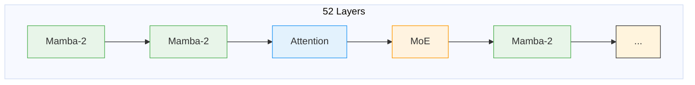
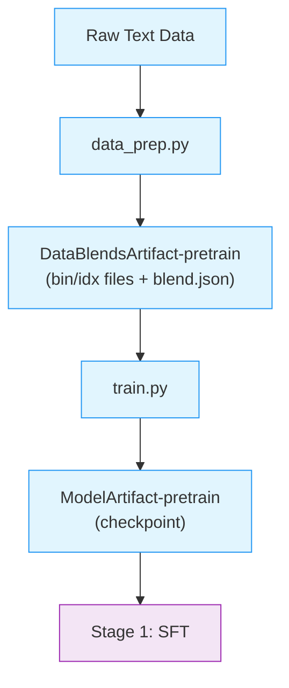

# Stage 0: Pretraining

This stage trains the base Nemotron 3 Nano model from scratch on 25 trillion tokens using [Megatron-Bridge](../nvidia-stack.md#megatron-bridge).

Nemotron 3 Nano is a **hybrid Mamba-Transformer-MoE** model with 52 layers, combining state-space models for efficiency, attention for global context, and mixture-of-experts for capacity. Key innovations include aux-loss-free MoE balancing and a two-phase data curriculum.

> **Open-Source Data Only**: This recipe uses exclusively open-sourced training data from the [Nemotron Pre-training Datasets](https://huggingface.co/collections/nvidia/nemotron-pre-training-datasets) collection, which is a subset of the full data used to train the released model. The recipe includes datasets from Nemotron-CC-Math-v1, Nemotron-CC-v2, Nemotron-CC-v2.1, and Nemotron-Pretraining-Specialized-v1. Results will differ from the benchmarks in the [tech report](https://research.nvidia.com/labs/nemotron/files/NVIDIA-Nemotron-3-Nano-Technical-Report.pdf). Use this recipe as a reference implementation to apply the methodology with your own data.

---

## Training Methodology

> **Training Framework**: Pretraining is implemented using [Megatron-Bridge](https://docs.nvidia.com/nemo/megatron-bridge/latest/), which provides the training loop, distributed training primitives, and checkpoint management. See [Training Entry Points](https://docs.nvidia.com/nemo/megatron-bridge/latest/training/entry-points.html) for details on how `pretrain()` works.
>
> For complete methodology, see [Tech Report Section 2](https://research.nvidia.com/labs/nemotron/files/NVIDIA-Nemotron-3-Nano-Technical-Report.pdf).

### Model Architecture

Nemotron 3 Nano uses a **hybrid Mamba-Transformer-MoE** architecture with 52 layers:

| Layer Type | Count | Role |
|------------|-------|------|
| Mamba-2 | 23 | Efficient sequence modeling via state space |
| Attention | 6 | Global context at key positions |
| MoE | 23 | Sparse computation with 8 experts per layer |

The hybrid pattern interleaves these layer types to balance efficiency and capability:



**Key design choices:**

- **Mamba-2 layers** provide linear-time sequence processing, enabling efficient inference on long contexts
- **Attention layers** are placed at strategic intervals (every ~8 layers) for global information mixing
- **MoE layers** use 8 experts with top-2 routing, keeping active parameters at ~4B while total parameters reach ~9B

> For architecture rationale, see [Tech Report Section 2.1](https://research.nvidia.com/labs/nemotron/files/NVIDIA-Nemotron-3-Nano-Technical-Report.pdf).
>
> For implementation details, see [Megatron-Bridge Nemotron 3](https://docs.nvidia.com/nemo/megatron-bridge/latest/models/llm/nemotron3.html).

### Pretraining Data

The pretraining corpus comprises four main dataset families:

| Dataset Family | Description |
|----------------|-------------|
| **Nemotron-CC-Code-v1** | High-quality code from Common Crawl |
| **Nemotron-Pretraining-Code-v2** | GitHub code with student-teacher generation |
| **Nemotron-CC-v2.1** | General English web crawl with synthetic rephrasing |
| **Nemotron-Pretrain-Specialized-v1** | Synthetic STEM, math textbooks, scientific coding |

Data spans 15 categories including web crawl (various quality tiers), code, math, academic, and multilingual content.

> For dataset details, see [Tech Report Section 2.2](https://research.nvidia.com/labs/nemotron/files/NVIDIA-Nemotron-3-Nano-Technical-Report.pdf).

### Data Mixture

Training follows a two-phase curriculum that transitions from broad coverage to focused quality:

| Phase | Tokens | Focus | Strategy |
|-------|--------|-------|----------|
| Phase 1 | 23.5T | Diversity | Broad coverage across all data sources |
| Phase 2 | 1.5T | Quality | Increased weight on high-quality and STEM data |

**Phase 1: Foundation Building**

- Uses all dataset families with balanced weights
- Emphasizes diversity: web (multiple quality tiers), code, math, multilingual
- Builds broad knowledge base and language understanding

**Phase 2: Quality Refinement**

- Increases sampling from high-quality sources:
  - `High-Quality` and `High-Quality-Synthetic` subsets
  - Nemotron-Pretraining-Specialized-v1 (STEM, math textbooks, scientific coding)
- Reduces low-quality web content
- Sharpens model capabilities on curated data

> For mixture strategy details, see [Tech Report Section 2.3](https://research.nvidia.com/labs/nemotron/files/NVIDIA-Nemotron-3-Nano-Technical-Report.pdf).

### Hyperparameters

| Parameter | Value |
|-----------|-------|
| **Total Tokens** | 25 trillion |
| **Batch Size** | 8192 sequences |
| **Sequence Length** | 4096 tokens |
| **Peak Learning Rate** | 1e-3 |
| **Minimum Learning Rate** | 1e-5 |
| **Optimizer** | AdamW (β₁=0.9, β₂=0.95) |
| **Weight Decay** | 0.1 |
| **MoE Load Balancing** | DeepSeek aux-loss-free strategy |

**Learning Rate Schedule:**

| Phase | Tokens | LR |
|-------|--------|-----|
| Warmup | 8.4B | 0 → 1e-3 |
| Stable | 20T (80%) | 1e-3 |
| Decay | 5T (20%) | 1e-3 → 1e-5 |

The warmup is token-based (8.4B tokens), not percentage-based. The stable phase maintains peak LR for 80% of training before cosine decay.

> For hyperparameter rationale, see [Tech Report Section 2.4](https://research.nvidia.com/labs/nemotron/files/NVIDIA-Nemotron-3-Nano-Technical-Report.pdf).

### MoE Load Balancing

Nemotron 3 Nano uses the **aux-loss-free load balancing** strategy from DeepSeek, avoiding the auxiliary losses traditionally used to balance expert utilization.

**Why aux-loss-free?**

Traditional MoE training adds an auxiliary loss term to encourage balanced routing. However, this:
- Adds a hyperparameter (aux loss weight) that's hard to tune
- Can conflict with the main training objective
- May hurt model quality at scale

**How it works:**

Instead of auxiliary losses, the router uses **bias terms** that are adjusted dynamically:
- Track expert utilization over a sliding window
- Increase bias for underutilized experts (more tokens routed to them)
- Decrease bias for overloaded experts
- No gradient flows through the bias adjustment

This achieves balanced expert utilization without interfering with the main loss function.

> For details, see the [Auxiliary-Loss-Free Load Balancing paper](https://arxiv.org/abs/2408.15664).

### Long-Context Extension

The LC-Phase extends context to 1M tokens after main pretraining:

| Parameter | Value |
|-----------|-------|
| **Duration** | 121 billion tokens |
| **Learning Rate** | 1e-5 (constant) |
| **Global Batch Size** | 48 |
| **Parallelism** | 8-way context/tensor/expert, 4-way pipeline |

> For long-context methodology, see [Tech Report Section 2.5](https://research.nvidia.com/labs/nemotron/files/NVIDIA-Nemotron-3-Nano-Technical-Report.pdf).

---

## Recipe Execution

### Quick Start

<div class="termy">

```console
// 1. Prepare data (tokenize to bin/idx format)
$ uv run nemotron nano3 data prep pretrain --run YOUR-CLUSTER

// 2. Run pretraining
$ uv run nemotron nano3 pretrain --run YOUR-CLUSTER
```

</div>

> **Note**: The `--run YOUR-CLUSTER` flag submits jobs via [NeMo-Run](../nemo-run.md). See [Execution through NeMo-Run](../nemo-run.md) for setup.

#### Direct Script Execution

Inside a container on a compute node:

```bash
# Data preparation
uv run python data_prep.py --config config/data_prep.yaml

# Training (single node)
uv run python train.py --config config/default.yaml

# Training (distributed)
uv run torchrun --nproc_per_node=8 train.py --config config/default.yaml
```

### Configuration

| File | Purpose |
|------|---------|
| `config/default.yaml` | Production configuration |
| `config/data_prep.yaml` | Data preparation settings |
| `config/data_blend_raw.json` | Dataset blend definition |

**Blend Configuration**

Data blends are defined in `config/data_prep/data_blend_raw.json`. Each entry specifies:

```json
{
  "name": "dataset-name",
  "path": "hf://nvidia/...",
  "subset": "subset-name",
  "weight": 1.0
}
```

Weights control sampling probability during data preparation. Phase transitions are implemented by using different blend configurations.

### Data Preparation

The `data_prep.py` script tokenizes raw text datasets into Megatron's binary format. See [Data Preparation Module](../data-prep.md) for detailed documentation.

#### CLI Command

```bash
uv run nemotron nano3 data prep pretrain [options]
```

| Option | Description |
|--------|-------------|
| `--run <profile>` | Execute on Slurm via [NeMo-Run](../nemo-run.md) |
| `--sample N` | Limit rows per dataset (for testing) |
| `--force` | Force re-run, ignoring cache |

#### Output

```
output/nano3/stage0_pretrain/
├── train/
│   ├── data_00000.bin
│   ├── data_00000.idx
│   └── ...
├── valid/
├── test/
└── blend.json
```

The output is registered as a [W&B Artifact](../artifacts.md) (`DataBlendsArtifact-pretrain`) for lineage tracking.

### Training

#### CLI Command

```bash
uv run nemotron nano3 pretrain [options] [overrides...]
```

| Option | Description |
|--------|-------------|
| `--run <profile>` | Attached—submits and waits, streaming logs ([NeMo-Run](../nemo-run.md)) |
| `--batch <profile>` | Detached—submits and exits immediately ([NeMo-Run](../nemo-run.md)) |
| `--dry-run` | Preview execution plan |
| `key=value` | Override config values ([CLI Framework](../cli.md#dotlist-overrides)) |

#### Override Examples

```bash
# More training iterations
uv run nemotron nano3 pretrain train.train_iters=5000

# Larger batch size
uv run nemotron nano3 pretrain train.global_batch_size=64

# Different checkpoint location
uv run nemotron nano3 pretrain checkpoint.save=/path/to/checkpoints
```

### Running with NeMo-Run

Configure execution profiles in `env.toml`:

```toml
[wandb]
project = "nemotron"
entity = "YOUR-TEAM"

[YOUR-CLUSTER]
executor = "slurm"
account = "YOUR-ACCOUNT"
partition = "batch"
nodes = 2
ntasks_per_node = 8
gpus_per_node = 8
mounts = ["/lustre:/lustre"]
```

See [Execution through NeMo-Run](../nemo-run.md) for complete configuration options.

### Checkpoint & Resume

Training automatically saves checkpoints at regular intervals. To resume from a checkpoint:

```bash
# Resume from a specific checkpoint
uv run nemotron nano3 pretrain checkpoint.load=/path/to/checkpoint

# Resume from latest checkpoint in a directory
uv run nemotron nano3 pretrain checkpoint.load=/path/to/checkpoints/
```

**Checkpoint Configuration:**

| Option | Description |
|--------|-------------|
| `checkpoint.save` | Directory for saving checkpoints |
| `checkpoint.load` | Path to checkpoint for resuming |
| `checkpoint.save_interval` | Steps between saves (default: 1000) |

Checkpoints use Megatron's distributed format, which handles model parallelism automatically. Each checkpoint contains model weights, optimizer state, and training progress.

> For checkpoint format and advanced options, see [Megatron-Bridge Checkpointing](https://docs.nvidia.com/nemo/megatron-bridge/latest/training/checkpointing.html).

### Artifact Lineage



---

## Infrastructure

This stage uses the following components from the [NVIDIA AI Stack](../nvidia-stack.md):

| Component | Role | Documentation |
|-----------|------|---------------|
| [Megatron-Core](../nvidia-stack.md#megatron-core) | Distributed training primitives (TP, PP, DP, EP, CP, SP) | [GitHub](https://github.com/NVIDIA/Megatron-LM) |
| [Megatron-Bridge](../nvidia-stack.md#megatron-bridge) | Model definitions, training loop, checkpoint management | [Docs](https://docs.nvidia.com/nemo/megatron-bridge/latest/) |

### Parallelism Configuration

Pretraining uses multiple parallelism strategies for efficient scaling. The specific values differ between main pretraining and long-context extension:

| Parallelism | Main Pretraining | Long-Context (LC) | Config Key |
|-------------|------------------|-------------------|------------|
| Tensor (TP) | 8 | 8 | `model.tensor_model_parallel_size` |
| Pipeline (PP) | 1 | 4 | `model.pipeline_model_parallel_size` |
| Expert (EP) | 8 | 8 | `model.expert_model_parallel_size` |
| Context (CP) | 1 | 8 | `model.context_parallel_size` |
| Sequence (SP) | Yes | Yes | `model.sequence_parallel` |
| Data (DP) | Auto | Auto | Computed from world size |

**Why the difference?**

- **Main pretraining** uses 4K sequences, so context parallelism (CP=1) isn't needed
- **Long-context extension** handles up to 1M tokens, requiring CP=8 to distribute sequences across GPUs
- **Pipeline parallelism** increases in LC phase (PP=4) to handle larger activation memory

> For parallelism concepts, see [NVIDIA AI Stack: Parallelism](../nvidia-stack.md#parallelism-strategies).

### Container

```
nvcr.io/nvidia/nemo:25.11.nemotron_3_nano
```

---

## Next Steps

After pretraining completes, proceed to [Stage 1: SFT](./sft.md) for instruction tuning.

## Reference

- [Tech Report Section 2](https://research.nvidia.com/labs/nemotron/files/NVIDIA-Nemotron-3-Nano-Technical-Report.pdf) — Pretraining methodology
- [NVIDIA AI Stack](../nvidia-stack.md) — Megatron-Core, Megatron-Bridge documentation
- [Artifact Lineage](../artifacts.md) — W&B artifact system
- **Recipe Source**: `src/nemotron/recipes/nano3/stage0_pretrain/` — Implementation details
- [Back to Overview](./README.md)
