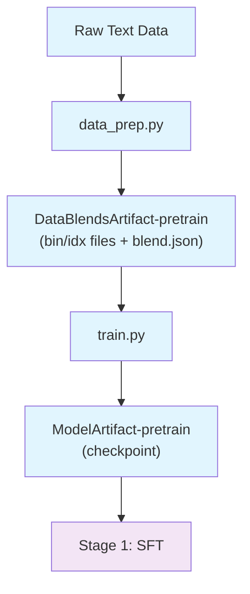

# Stage 0: Pretraining

This stage trains the base Nemotron 3 Nano model from scratch on 25 trillion tokens using Megatron-Bridge.

## Overview

Pretraining produces the base language model checkpoint that serves as the foundation for subsequent instruction tuning (SFT) and alignment (RL) stages. The methodology follows the approach described in [Tech Report Section 2](https://arxiv.org/abs/2506.XXXXX).

Nemotron-3-Nano-30B-A3B-Base was pretrained using the Warmup-Stable-Decay learning rate schedule on 25 trillion tokens spanning 15 data categories. Training proceeds in two phases with a curriculum-based data mixture:

| Phase | Tokens | Focus |
|-------|--------|-------|
| Phase 1 | 23.5T | High diversity across web, code, math, and multilingual data |
| Phase 2 | 1.5T | High-quality data with increased weight on curated sources |

The base model achieves better accuracy than equivalent-sized Qwen3-30B-A3B-Base on most academic benchmarks across Code, Math, Long Context, General Knowledge, and Commonsense Understanding categories.

> **Open-Source Data Only**: This recipe trains exclusively on the open-sourced subset of pretraining data. Results will differ from the tech report benchmarks, which used additional proprietary data. Use this recipe as a reference implementation to apply the methodology with your own data.

| Component | Description |
|-----------|-------------|
| `data_prep.py` | Tokenizes raw text into Megatron bin/idx format |
| `train.py` | Runs pretraining using Megatron-Bridge |
| `config/` | Configuration files for data prep and training |

## Pretraining Data

The pretraining corpus comprises four main dataset families, each contributing distinct training signals.

### Nemotron-CC-Code-v1

High-quality code pretraining corpus constructed by applying a modified version of the Nemotron-CC-Math pipeline to Common Crawl pages containing code content.

The pipeline:
1. Filters out code pages using a fast pattern matching classifier
2. Renders each document using Lynx for reliable layout/indentation preservation
3. Processes through an LLM-based cleaning stage using phi-4 model to remove boilerplate
4. Applies a lightweight code-quality relevance classifier
5. Standardizes LaTeX code blocks with structural fidelity

This pipeline produces a 427.92B-token corpus in which equations are preserved and noise is minimized.

### Nemotron-Pretraining-Code-v2

Additional code sourced from GitHub repositories identified as missing from the existing corpus, with a cut-off date of April 15, 2025. The pipeline includes:

- **Student-teacher generation**: Using Qwen3 32B to generate question-answer pairs from source code seeds
- **Code review**: Python/C++ style dialogue grounded with code snippets and full source files
- **Source-code rewriting**: LLM-based transformation using Style-Guided Code Rewriting (SGCR) and Self-Contained Optimization Rewriting (SCOR) prompts
- **Python-to-C++ transpilation**: Improving downstream C++ code generation accuracy

### Nemotron-CC-v2.1

General English web crawl data from Common Crawl, including:

- Medium-Quality, Medium-High-Quality, and High-Quality buckets
- Synthetic rephrasing using Qwen3-30B-A3B
- High-quality English tokens translated from 9 languages (Chinese, French, German, Italian, Japanese, Polish, Portuguese, Russian, Spanish)
- Nemotron-CC rephrasing prompts applied to high-quality data

Overall, this dataset contributes 2.5T new tokens from Common Crawl data.

### Nemotron-Pretrain-Specialized-v1

Synthetic datasets specialized for STEM Reasoning and scientific coding:

| Dataset | Description |
|---------|-------------|
| **Synthetic Wikipedia** | Revised English Wikipedia articles using Qwen3-30B-A3B-Instruct-2507 with improved clarity and formatting |
| **Synthetic Math Textbook** | Well-structured educational textbook-style sections from Nemotron-CC-Math, classified by educational level |
| **Synthetic Scientific Coding** | Code-embedded articles and computational coding problems using STEM-related documents |
| **InfinityByte Cross-Domain Code** | Competitive coding problems injected with concepts from mathematics, physics, chemistry, and other sciences |
| **Synthetic STEM Reasoning (RQA)** | Reasoning Question-Answer dataset targeting undergraduate/graduate level STEM content |

### Data Categories

The full pretraining corpus spans 15 categories:

| Category | Description |
|----------|-------------|
| crawl-medium | Web crawl, medium quality |
| crawl-medium-high | Web crawl, medium-high quality |
| sys-crawl-medium-high | Synthetic-enhanced medium-high crawl |
| crawl-high | Web crawl, high quality |
| sys-crawl-high | Synthetic-enhanced high-quality crawl |
| math | Mathematical content |
| Wikipedia | Encyclopedia articles |
| code | Programming source code |
| semantic-code | Code with semantic annotations |
| academic | Academic papers and textbooks |
| Crawl++ | OpenWebText, BigScience, Reddit datasets |
| multilingual | 15 languages: Arabic, Chinese, Czech, Danish, Dutch, Finnish, French, German, Hebrew, Hindi, Italian, Japanese, Korean, Polish, Portuguese, Russian, Spanish, Swedish, Thai |

### Data Mixture Strategy

The data mixture balances coverage and quality using composite weights to ensure similar estimated quality across sources. Higher-quality datasets receive proportionally greater weight.

**Curriculum-based approach**:
1. **Phase 1 (0-94% of training)**: Diverse data mixture promoting broad coverage
2. **Phase 2 (94-100% of training)**: Emphasis on high-quality datasets for final refinement

## Hyperparameters

| Parameter | Value |
|-----------|-------|
| **Total Tokens** | 25 trillion |
| **Batch Size** | 8192 sequences |
| **Sequence Length** | 4096 tokens |
| **Learning Rate** | 1e-4 (stable) → 1e-5 (decay) |
| **Warmup** | 80% of training (20T tokens) |
| **Decay** | Final 20% of training (5T tokens) |
| **Optimizer** | AdamW |
| **Weight Decay** | 0.1 |
| **β₁** | 0.9 |
| **β₂** | 0.95 |
| **MoE Load Balancing** | DeepSeek aux-loss-free strategy |
| **Load Balance Coefficient** | 1e-4 |
| **Update Rate** | 1e-3 |

## Long-Context Extension

The long-context phase (LC-Phase) extends the model's context capability to 1M tokens. This phase runs after main pretraining completes.

| Parameter | Value |
|-----------|-------|
| **Duration** | 121 billion tokens |
| **Learning Rate** | 1e-5 (constant) |
| **Global Batch Size** | 48 |
| **Context Parallelism** | 8-way |
| **Tensor Parallelism** | 8-way |
| **Expert Parallelism** | 8-way |
| **Pipeline Parallelism** | 4-way |
| **Hardware** | H100 GPUs |

### LC-Phase Data

- Long-context document QA dataset from Nemotron Nano 2, scaled 3x
- RULER-style data for CPT data blend
- The model first performs CPT on context length of 524,288 (512k) tokens, then scales to 1M

## Quick Start

### Using nemotron CLI (Recommended)

```bash
# 1. Prepare data (tokenize to bin/idx format)
uv run nemotron nano3 data prep pretrain --run YOUR-CLUSTER

# 2. Run pretraining
uv run nemotron nano3 pretrain --run YOUR-CLUSTER

# Quick test with tiny config
uv run nemotron nano3 pretrain -c tiny --run YOUR-CLUSTER
```

### Direct Script Execution

Inside a container on a compute node:

```bash
# Data preparation
uv run python data_prep.py --config config/data_prep.yaml

# Training (single node)
uv run python train.py --config config/tiny.yaml

# Training (distributed)
uv run torchrun --nproc_per_node=8 train.py --config config/tiny.yaml
```

## Data Preparation

The `data_prep.py` script tokenizes raw text datasets into Megatron's binary format.

### CLI Command

```bash
uv run nemotron nano3 data prep pretrain [options]
```

| Option | Description |
|--------|-------------|
| `--run <profile>` | Execute on Slurm via NeMo-Run |
| `--sample N` | Limit rows per dataset (for testing) |
| `--force` | Force re-run, ignoring cache |

### Input

Dataset blend defined in `config/data_blend_raw.json`:

```json
{
  "datasets": [
    {"name": "dataset-name", "weight": 1.0, "split": "train"},
    ...
  ]
}
```

### Output

```
output/nano3/stage0_pretrain/
├── train/
│   ├── data_00000.bin
│   ├── data_00000.idx
│   └── ...
├── valid/
│   └── ...
├── test/
│   └── ...
└── blend.json          # Per-split data paths for Megatron-Bridge
```

The output is registered as a W&B Artifact (`DataBlendsArtifact-pretrain`) for lineage tracking.

### Configuration

`config/data_prep.yaml`:

```yaml
blend_path: config/data_blend_raw.json
output_dir: output/nano3/stage0_pretrain
num_shards: 128
tokenizer_model: nvidia/NVIDIA-Nemotron-Nano-9B-v2
add_bos: false
add_eos: true
```

## Training

The `train.py` script runs pretraining using Megatron-Bridge.

### CLI Command

```bash
uv run nemotron nano3 pretrain [options] [overrides...]
```

| Option | Description |
|--------|-------------|
| `--run <profile>` | Attached—submits and waits, streaming logs |
| `--batch <profile>` | Detached—submits and exits immediately |
| `-c <config>` | Config file (e.g., `-c tiny` for testing) |
| `--dry-run` | Preview execution plan |
| `key=value` | Override config values (Hydra-style) |

### Input

- **Data**: `DataBlendsArtifact-pretrain` (from data prep)
- **Config**: `config/default.yaml` or `config/tiny.yaml`

### Output

- Model checkpoints saved to configured `checkpoint.save` path
- Registered as W&B Artifact for downstream stages

### Configuration Files

| File | Purpose |
|------|---------|
| `config/default.yaml` | Production configuration |
| `config/tiny.yaml` | Testing (small model, 1700 iterations) |
| `config/data_blend_raw.json` | Full dataset blend |
| `config/data_blend_raw_small.json` | Small blend (math-only) for testing |

#### config/tiny.yaml

```yaml
run:
  data: DataBlendsArtifact-pretrain:latest

recipe:
  _target_: megatron.bridge.recipes.qwen.qwen3.qwen3_8b_pretrain_config
  per_split_data_args_path: ${art:data,path}/blend.json

train:
  train_iters: 1700
  global_batch_size: 32

scheduler:
  lr_warmup_iters: 32

logger:
  log_interval: 10
  wandb_project: ${run.wandb.project}
  wandb_entity: ${run.wandb.entity}

checkpoint:
  save: /nemo_run/pretrain
  save_interval: 20
```

### Override Examples

```bash
# More training iterations
uv run nemotron nano3 pretrain -c tiny train.train_iters=5000

# Larger batch size
uv run nemotron nano3 pretrain -c tiny train.global_batch_size=64

# Different checkpoint location
uv run nemotron nano3 pretrain -c tiny checkpoint.save=/path/to/checkpoints

# Multiple overrides
uv run nemotron nano3 pretrain -c tiny \
    train.train_iters=5000 \
    scheduler.lr_warmup_iters=100 \
    checkpoint.save_interval=50
```

## Running with NeMo-Run

The nemotron CLI uses [NeMo-Run](https://github.com/NVIDIA-NeMo/Run) for job orchestration.

### env.toml Setup

Configure execution profiles in `env.toml`:

```toml
[wandb]
project = "nemotron"
entity = "YOUR-TEAM"

[YOUR-CLUSTER]
executor = "slurm"
account = "YOUR-ACCOUNT"
partition = "batch"
nodes = 2
ntasks_per_node = 8
gpus_per_node = 8
mounts = ["/lustre:/lustre"]
```

Container images are specified in recipe config files, not in env.toml.

### Execution Examples

```bash
# Attached (wait for completion, stream logs)
uv run nemotron nano3 pretrain -c tiny --run YOUR-CLUSTER

# Detached (submit and exit immediately)
uv run nemotron nano3 pretrain -c tiny --batch YOUR-CLUSTER

# Preview without executing
uv run nemotron nano3 pretrain -c tiny --run YOUR-CLUSTER --dry-run
```

See [nemo-run.md](../nemo-run.md) for complete configuration options.

## Artifact Lineage



## Next Steps

After pretraining completes, proceed to [Stage 1: SFT](./sft.md) for instruction tuning.

## Reference

- [Tech Report Section 2](https://arxiv.org/abs/2506.XXXXX) — Pretraining methodology
- [Recipe Source](../../../src/nemotron/recipes/nano3/stage0_pretrain/) — Implementation details
- [Back to Overview](./README.md)
