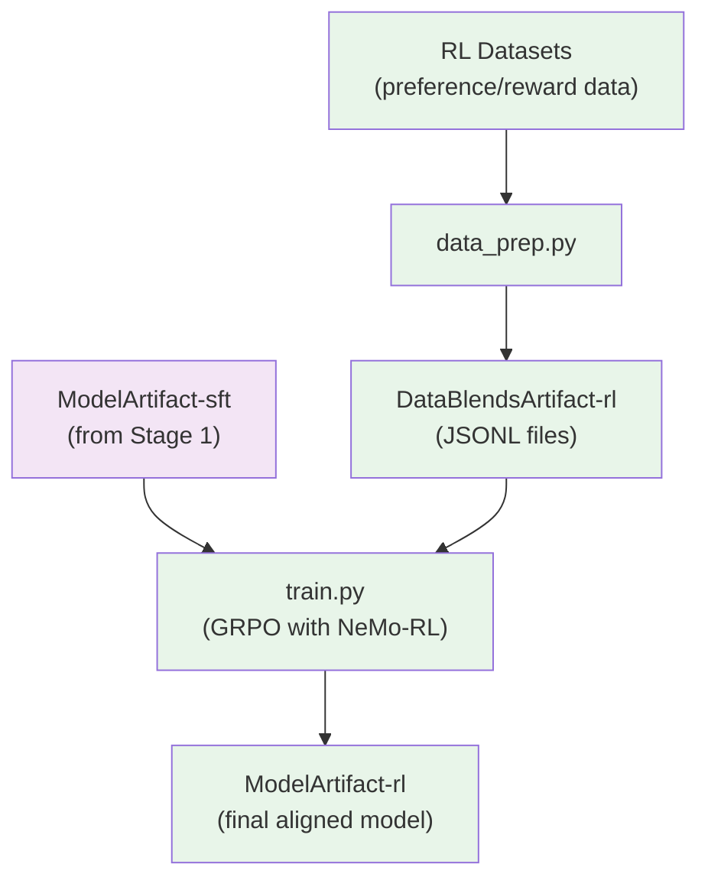

# Stage 2: Reinforcement Learning (RL)

This stage aligns the instruction-tuned model using GRPO (Group Relative Policy Optimization) with NeMo-RL.

## Overview

RL training transforms the SFT model into a fully aligned model through multiple reinforcement learning methodologies. The approach follows [Tech Report Section 3.2](https://arxiv.org/abs/2506.XXXXX).

The RL pipeline consists of three components:
1. **RLVR (RL from Verifiable Rewards)** — Multi-environment training with verifiable reward signals
2. **RLHF with GenRM** — Generative reward model-based alignment
3. **DPO for tool hallucination** — Preference learning to reduce spurious tool calls

Training alternates between RLVR and RLHF stages: one RLVR stage immediately after SFT, one RLHF stage, then a final RLVR stage.

> **Open-Source Data Only**: This recipe trains exclusively on the open-sourced subset of RL data. Results will differ from the tech report benchmarks, which used additional proprietary data. Use this recipe as a reference implementation to apply the methodology with your own data.

| Component | Description |
|-----------|-------------|
| `data_prep.py` | Converts datasets to JSONL format for NeMo-RL |
| `train.py` | Runs GRPO training using NeMo-RL with Ray |
| `config/` | Configuration files for data prep and training |

## Multi-Environment RLVR

Multi-environment RLVR trains on all reward environments simultaneously, resulting in stable gains across all benchmarks throughout training. Single-environment training often causes co-reward degradation of other benchmarks.

### Environments

Training uses 7 reward environments through NeMo-Gym:

| Environment | Dataset | Description |
|-------------|---------|-------------|
| **Competition Math** | DAPO, SkyWorks math | Mathematical reasoning with 17k and 156k tasks respectively |
| **Competition Coding** | Competitive coding problems | Code correctness verification with test case execution |
| **Question Answering** | Multiple choice STEM datasets | Verifiable answers generated from information in reference documents |
| **Structured Outputs** | JSON schema tasks | Strong JSON schema adherence enforced through strict complexity controls and rejection sampling |
| **Instruction Following** | IFEval, Multi-Challenge | Multi-constraint instruction compliance verification |
| **Long Context** | 12K challenging QA pairs | Multi-document synthesis with 256k total input tokens |
| **Agentic Tool Use** | Workplace Assistant, Multi-Turn Agent | Tool call correctness and sandbox task completion |

#### Agentic Tool Use Details

**Workplace Assistant**: A multi-step verifiable tool-calling setup adapted from Stylos (2024). Tests the agent's ability to execute tasks in a workplace setting with:
- 5 databases
- 26 tools
- 690 tasks representing common business activities (sending emails, scheduling meetings, etc.)

Correctness is verified by executing tool calls and comparing results to ground truth database state.

**Multi-Turn Agent**: Conversational agent environment testing tool use capabilities. Comprising ~1K tasks, this environment simulates complex banking scenarios like assisting customers with unblocking credit cards or solving account disputes. Correctness is verified by executing tool calls and comparing the resulting database state against predefined ground truth.

### Infrastructure: NeMo-Gym

NeMo-Gym provides the infrastructure for scaling RL to many environments. The architecture uses three server types:

1. **Agent servers** — Implement rollout kernels for RL environments
2. **Model servers** — Wrap inference engines (vLLM) for prompt-response APIs
3. **Resource servers** — Manage compute allocation

### GRPO Algorithm

Training uses synchronous GRPO with masked importance sampling to mitigate training-inference alignment mismatch.

| Parameter | Value |
|-----------|-------|
| **Prompts per step** | 128 |
| **Generations per prompt** | 16 |
| **Learning Rate** | Specified in config |
| **Max Generation Length** | 49K tokens |
| **MoE Load Balancing** | DeepSeek aux-loss-free strategy |
| **Epsilon Filtering** | Cosine annealing with 4% limit |

Cosine filtering boosts performance on reasoning-intensive benchmarks.

### Curriculum Sampling

Curriculum sampling ensures stable learning across multiple domains throughout training, while random sampling biases models toward easier tasks.

The curriculum strategy:
1. Model target pass-rate distribution as a Gaussian function for each domain
2. Shift from high pass-rate (easier) samples early in training to low pass-rate (harder) samples later
3. Decrease target mean of Gaussian distribution linearly throughout training
4. Shuffle samples from different domains within each batch

This Gaussian sampling prevents overfitting to either overly easy or overly difficult examples.

### Data Mixture and Curriculum

Training on all environments simultaneously provides:
- Stable gains across all benchmarks throughout training
- Prevention of co-reward degradation seen in single-environment training
- Smooth and uniform improvement in model capabilities

Once training progress plateaus (batch-wise pass rate stabilizes), the best RL checkpoint is used as the re-profile starting point. The pipeline then constructs a new curriculum and repeats.

## Reinforcement Learning from Human Feedback (RLHF)

### GenRM: Generative Reward Model

Generative reward models (GenRM) generalize better than traditional Bradley-Terry models, reducing risk of reward hacking during RLHF.

The GenRM training process:
1. Given conversation history, user request, and two candidate responses
2. GenRM reasons through strengths and weaknesses of both responses
3. Produces individual helpfulness scores and a ranking score

| Parameter | Value |
|-----------|-------|
| **Prompts per batch** | 128 |
| **Generations per prompt** | 8 |
| **Gradient steps** | 1 per full batch |

### RLHF Training with GenRM

With a trained GenRM, RLHF proceeds using the same prompt structure as RLVR.

#### Circular Comparison Strategy

Computing all pairs of N responses requires O(N²) comparisons—prohibitively expensive for large N. Instead, a circular comparison strategy compares each response only with its neighbor:

```
r₁ → r₂ → r₃ → ... → rₙ → r₁
```

This yields exactly N comparisons per batch.

#### Length-Normalized Reward Adjustment

To ensure fair comparison across responses of varying lengths:

1. **Normalize lengths** within each group (preserving overall reward scale)
2. **Center the adjustment** to be zero-mean within groups
3. **Apply quality-gated conciseness bonus** for shorter responses without sacrificing quality

The base reward R^{base} for response rₖ is computed by averaging scores from pairwise comparisons with neighboring responses. The length bonus encourages concise responses through:

- Scaling parameter α = 0.5
- Length mean normalization within groups
- Quality threshold gating

#### RLHF Hyperparameters

| Parameter | Value |
|-----------|-------|
| **Prompts per batch** | 128 |
| **Responses per prompt** | 16 |
| **Comparison strategy** | Circular (N comparisons) |
| **Length bonus α** | 0.5 |

## Reasoning Control

Nemotron 3 Nano supports two forms of reasoning control:

1. **Reasoning on/off control** — Strip reasoning traces from a random 10% of samples during training
2. **Token budget control** — Randomly truncate 3% of reasoning traces to different reasoning budgets, then continue with original post-reasoning response

## DPO for Reducing Tool Hallucination

DPO (Direct Preference Optimization) reduces hallucinated tool usage as a complementary technique to RL. While the released model achieves comparable performance through RL alone, DPO provides additional improvement with minimal computational overhead.

### DPO Data Construction

Data is constructed using 2,000 reasoning tasks with 1,000 math/science problems and 1,000 STEM multiple-choice questions. For each problem, 32 on-policy solutions are generated, then processed through the DPO data-construction pipeline:

1. **Assign preference labels** based on correctness and tool-usage patterns
2. **Categorize into three types**:
   - **With-Tools**: Tools available, labels depend on final answer correctness
   - **Hallucination-Penalty**: Tools not declared but hallucinated tool invocation labeled as rejected
   - **No-Tools**: Neither exposure to tools nor hallucination

The pipeline produces ~50k preference samples.

### DPO Training Setup

| Parameter | Value |
|-----------|-------|
| **Learning Rate** | 3e-6 |
| **Batch Size** | 128 |
| **Training Steps** | 50 |
| **SFT Loss Coefficient** | 0.2 |
| **DPO Loss Coefficient** | 1.0 |
| **KL Loss Coefficient** | 0.05 |

### DPO Results

DPO demonstrates that minimal training meaningfully reduces hallucinated tool calls:

| Metric | Before DPO | After DPO |
|--------|------------|-----------|
| **AIME25 Accuracy** | 80.88% | 84.58% |
| **Hallucination Rate** | 8.33% | 0.7% |

The improvement indicates DPO not only suppresses undesirable tool-related behaviors but enhances overall solution quality.

## Quick Start

### Using nemotron CLI (Recommended)

```bash
# 1. Prepare data (convert to JSONL format)
uv run nemotron nano3 data prep rl --run YOUR-CLUSTER

# 2. Run RL training
uv run nemotron nano3 rl --run YOUR-CLUSTER

# Quick test with tiny config
uv run nemotron nano3 rl -c tiny --run YOUR-CLUSTER
```

### Direct Script Execution

Inside a container on a compute node (requires NeMo-RL and Ray):

```bash
# Data preparation
uv run python data_prep.py --config config/data_prep.yaml

# Training (Ray initialized internally)
uv run python train.py --config config/grpo_nanov3.yaml
```

## Data Preparation

The `data_prep.py` script converts datasets to JSONL format compatible with NeMo-RL's NeMo-Gym interface.

### CLI Command

```bash
uv run nemotron nano3 data prep rl [options]
```

| Option | Description |
|--------|-------------|
| `--run <profile>` | Execute on Slurm via NeMo-Run |
| `--sample N` | Limit rows per dataset (for testing) |
| `--force` | Force re-run, ignoring cache |

### Input

RL datasets defined in `config/data_blend_raw.json`. Data is transformed using the `nemotron_rl` transform which extracts from `responses_create_params.input`.

### Output

```
output/nano3/stage2_rl/
├── train/
│   └── data.jsonl       # Training data in NeMo-Gym format
├── val/
│   └── data.jsonl       # Validation data
├── test/
│   └── data.jsonl       # Test data
└── manifest.json        # Split paths and ratios
```

The output is registered as a W&B Artifact (`DataBlendsArtifact-rl`) for lineage tracking.

### Configuration

`config/data_prep.yaml`:

```yaml
blend_path: config/data_blend_raw.json
output_dir: output/nano3/stage2_rl
shard_size: 256MB
split_output: train_val_test
train_ratio: 0.98
val_ratio: 0.01
```

| Parameter | Description |
|-----------|-------------|
| `split_output` | `train_val_test` for separate splits, `none` for single output |
| `train_ratio` | Fraction for training split (default 0.98) |
| `val_ratio` | Fraction for validation split (default 0.01) |

## Training

The `train.py` script runs GRPO training using NeMo-RL with Ray for distributed execution.

### CLI Command

```bash
uv run nemotron nano3 rl [options] [overrides...]
```

| Option | Description |
|--------|-------------|
| `--run <profile>` | Attached—submits and waits, streaming logs |
| `--batch <profile>` | Detached—submits and exits immediately |
| `-c <config>` | Config file (e.g., `-c tiny` for testing) |
| `--dry-run` | Preview execution plan |
| `key=value` | Override config values (Hydra-style) |

### Input

- **Model**: SFT checkpoint from Stage 1 (`ModelArtifact-sft`)
- **Data**: `DataBlendsArtifact-rl` (from data prep)
- **Config**: `config/grpo_nanov3.yaml` or `config/tiny.yaml`

### Output

- Aligned model checkpoints
- Training logs and metrics
- Registered as W&B Artifact (`ModelArtifact-rl`)

### Configuration Files

| File | Purpose |
|------|---------|
| `config/grpo_nanov3.yaml` | Production GRPO configuration |
| `config/tiny.yaml` | Testing variant |
| `config/data_blend_raw.json` | RL dataset blend |

### Key Configuration Sections

```yaml
policy:
  model_name: "path/to/sft/checkpoint"
  tokenizer: "nvidia/NVIDIA-Nemotron-Nano-9B-v2"
  generation:
    temperature: 0.7
    max_new_tokens: 1024

grpo:
  num_iterations: 100
  batch_size: 32
  learning_rate: 1e-6

data:
  train_jsonl_fpath: "/path/to/train/data.jsonl"
  validation_jsonl_fpath: "/path/to/val/data.jsonl"

env:
  nemo_gym:
    # NeMo-Gym environment configuration
```

### Override Examples

```bash
# More iterations
uv run nemotron nano3 rl -c tiny grpo.num_iterations=200

# Different temperature
uv run nemotron nano3 rl -c tiny policy.generation.temperature=0.8

# Different learning rate
uv run nemotron nano3 rl -c tiny grpo.learning_rate=5e-7

# Multiple overrides
uv run nemotron nano3 rl -c tiny \
    grpo.num_iterations=200 \
    policy.generation.temperature=0.8 \
    grpo.learning_rate=5e-7
```

## Running with NeMo-Run

The nemotron CLI uses [NeMo-Run](https://github.com/NVIDIA-NeMo/Run) for job orchestration. RL training uses Ray internally for distributed execution.

### env.toml Setup

Configure execution profiles in `env.toml`:

```toml
[wandb]
project = "nemotron"
entity = "YOUR-TEAM"

[YOUR-CLUSTER]
executor = "slurm"
account = "YOUR-ACCOUNT"
partition = "batch"
nodes = 2
ntasks_per_node = 8
gpus_per_node = 8
mem = "0"
exclusive = true
mounts = ["/lustre:/lustre"]
```

Container images are specified in recipe config files, not in env.toml.

### Execution Examples

```bash
# Attached (wait for completion, stream logs)
uv run nemotron nano3 rl -c tiny --run YOUR-CLUSTER

# Detached (submit and exit immediately)
uv run nemotron nano3 rl -c tiny --batch YOUR-CLUSTER

# Preview without executing
uv run nemotron nano3 rl -c tiny --run YOUR-CLUSTER --dry-run
```

See [nemo-run.md](../nemo-run.md) for complete configuration options.

## GRPO Algorithm

GRPO (Group Relative Policy Optimization) optimizes the policy through:

1. **Generate responses** from current policy
2. **Evaluate** using NeMo-Gym reward environments
3. **Compute group-relative advantages** across response groups
4. **Update policy** to favor higher-reward responses

Key features:
- Efficient batched generation and evaluation
- Ray-based distributed training
- NeMo-Gym integration for flexible reward computation
- Masked importance sampling for training-inference alignment

## Artifact Lineage



## Requirements

- **NeMo-RL**: Required for GRPO training
- **Ray**: Automatically initialized for distributed execution
- **NeMo-Gym**: Provides reward environments
- **GPU nodes**: Recommended 8 GPUs per node

## Reference

- [Tech Report Section 3.2](https://arxiv.org/abs/2506.XXXXX) — RL methodology
- [Stage 0: Pretraining](./pretrain.md) — Pretrain the base model
- [Stage 1: SFT](./sft.md) — Instruction tuning
- [Recipe Source](../../../src/nemotron/recipes/nano3/stage2_rl/) — Implementation details
- [Back to Overview](./README.md)
