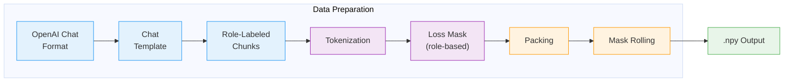
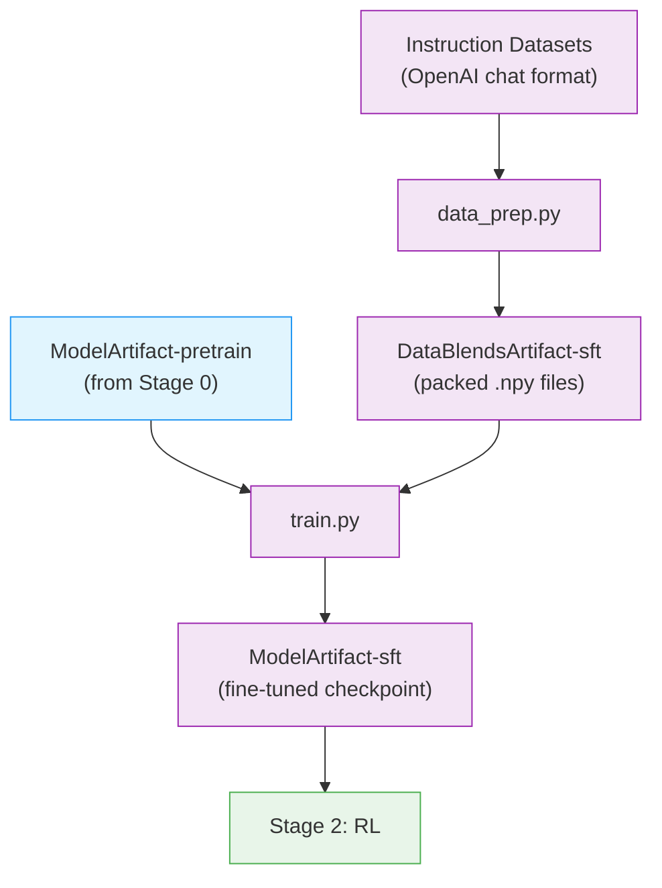

# Stage 1: Supervised Fine-Tuning (SFT)

This stage fine-tunes the pretrained model for instruction following using [Megatron-Bridge](../nvidia-stack.md#megatron-bridge).

> **Open-Source Data Only**: This recipe uses exclusively open-sourced SFT data from the [Nemotron Post-training Datasets](https://huggingface.co/collections/nvidia/nemotron-post-training-v3) collection, which is a subset of the full data used to train the released model. The recipe includes datasets from Nemotron-Science-v1, Nemotron-Instruction-Following-Chat-v1, Nemotron-Math-Proofs-v1, Nemotron-SWE-v1, Nemotron-Agentic-v1, and Nemotron-Competitive-Programming-v1. Results will differ from the benchmarks in the [tech report](https://research.nvidia.com/labs/nemotron/files/NVIDIA-Nemotron-3-Nano-Technical-Report.pdf). Use this recipe as a reference implementation to apply the methodology with your own data.

---

## Training Methodology

> **Training Framework**: SFT is implemented using [Megatron-Bridge](https://docs.nvidia.com/nemo/megatron-bridge/latest/)'s `finetune()` entry point, which loads a pretrained checkpoint and handles the training loop with role-based loss masking. See [Training Entry Points](https://docs.nvidia.com/nemo/megatron-bridge/latest/training/entry-points.html) for implementation details.
>
> For complete methodology, see [Tech Report Section 3.1](https://research.nvidia.com/labs/nemotron/files/NVIDIA-Nemotron-3-Nano-Technical-Report.pdf).

### Data Preparation Pipeline

Before training, chat conversations are transformed into training-ready sequences through several stages:



| Stage | What Happens |
|-------|--------------|
| **OpenAI Chat Format** | Input messages with `role` (system/user/assistant) and `content` fields |
| **Chat Template** | Renders messages using Nano3 Jinja template with special tokens (`<\|im_start\|>`, `<\|im_end\|>`) |
| **Role-Labeled Chunks** | Splits rendered text back into chunks, each tagged with its source role |
| **Tokenization** | Converts text chunks to token IDs |
| **Loss Mask** | Builds mask: `1` for assistant tokens, `0` for system/user tokens |
| **Packing** | Multiple sequences packed into fixed-length bins (4096 tokens) |
| **Mask Rolling** | Shifts mask by 1 position for next-token prediction alignment |

**Multi-turn splitting**: For conversations with reasoning content (`reasoning_content` field), the pipeline creates separate training sequences at each user turn. Reasoning from previous turns is dropped when a new user message appears—this matches inference behavior where users don't see intermediate reasoning.

> For data preparation implementation, see **Recipe Source**: `src/nemotron/recipes/nano3/stage1_sft/data_prep.py`

### Loss Masking

Loss masking determines which tokens contribute to the training loss. In SFT, we only want the model to learn to generate responses—not to predict prompts or system instructions.

**Why mask non-assistant tokens?**

The model should learn to *respond*, not to *prompt*. If we computed loss on user messages, the model would be optimized to predict "What is 2+2?" given prior context—which isn't useful for an assistant. By masking user and system tokens (setting their loss weight to 0), gradients only flow from assistant responses, teaching the model what to generate without wasting capacity on predicting inputs.

| Role | Loss Mask | Training Signal |
|------|-----------|-----------------|
| `system` | 0 | Ignored (instructions) |
| `user` | 0 | Ignored (prompts) |
| `assistant` | 1 | Learned (responses) |

**Why roll the mask by 1?**

In next-token prediction, the model predicts `token[i+1]` given `tokens[0:i]`. The loss compares the prediction against the *label*, which is the input sequence shifted by one position:

```
Position:     0    1    2    3    4
Input:       [A]  [B]  [C]  [D]  [E]
Label:       [B]  [C]  [D]  [E]  [_]   <- shifted by 1
```

If assistant content starts at position 2 (`[C]`), we want loss on predicting `[C]`, `[D]`, and `[E]`. But the label for position 2 is `[D]`—so we need to shift the mask to align with labels:

```
Original mask:  [0]  [0]  [1]  [1]  [1]   <- "assistant starts at C"
Rolled mask:    [0]  [0]  [0]  [1]  [1]   <- aligns with labels D, E
```

The pipeline rolls the loss mask by 1 position so it correctly masks the *predictions* (labels) rather than the *inputs*.

**Truncation behavior (`max_doc_tokens`):**

- **Default (null)**: No truncation—full sequences are preserved
- **When set**: Sequences exceeding the limit are truncated from the end, with the loss mask adjusted accordingly

> For implementation details, see `src/nemotron/data_prep/chat_sft_processor.py`

### Packed Sequences

**Why pack sequences?**

Individual chat conversations vary in length—some are 50 tokens, others 3000. Without packing, each training sample would require padding to the maximum sequence length, wasting compute on empty tokens. Packing concatenates multiple conversations into a single fixed-length sequence (default 4096 tokens), maximizing GPU utilization.

The packed sequence format stores everything Megatron-Bridge needs for training:

| Field | Description |
|-------|-------------|
| `input_ids` | Concatenated token IDs from multiple conversations |
| `loss_mask` | Rolled mask indicating which positions contribute to loss (see [Loss Masking](#loss-masking)) |
| `seq_start_id` | Boundary indices marking where each original conversation starts within the pack |

**How `seq_start_id` works:**

When multiple conversations are packed together, the model needs to know where one ends and another begins—otherwise attention could "leak" between unrelated conversations. The `seq_start_id` array marks these boundaries:

```
Pack: [Conv A tokens] [Conv B tokens] [Conv C tokens]
       ^              ^              ^
seq_start_id: [0,    128,           384]
```

Megatron-Bridge uses these boundaries for:
- **Variable-length attention**: Attention is masked so tokens from Conv A can't attend to Conv B
- **FlashAttention optimization**: Boundaries map to `cu_seqlens` parameter for efficient packed attention

> For packing implementation, see `src/nemotron/data_prep/packing/builder.py`

### Chat Template

Nemotron 3 Nano supports both reasoning and non-reasoning modes:

- **Multi-Step**: Existing reasoning tokens preserved for reuse in subsequent steps
- **Multi-Turn**: Reasoning from previous turns dropped when user message introduced
- **Tool Calling**: Uses XML-style special tags to reduce character escaping

### SFT Data Domains

| Domain | Description |
|--------|-------------|
| **Competition Math** | Tool-integrated reasoning with GPT-OSS teachers |
| **Competition Code** | OpenCodeReasoning solutions with obfuscation/complication |
| **InfinityByte** | Cross-domain code synthesis at model capability boundaries |
| **STEM Reasoning (RQA)** | Reasoning Q&A from undergraduate/graduate STEM content |
| **Conversational Tool Use** | Multi-turn trajectories with simulated tool execution |
| **Long Context** | 128k mean token length, 256k hard limit |
| **Formal Proofs** | Lean theorem proving with 300k examples |
| **Multilingual** | French, Spanish, Italian, German, Japanese |
| **Terminal Use** | Terminal operations from Terminal Bench |
| **General Chat** | Multi-turn responses from LMSYS and WildChat |
| **Instruction Following** | Tulu 3 methodology with verifier filtering |
| **Safety** | Refusal behaviors from safety datasets |
| **Software Engineering** | GitHub issue resolution trajectories |
| **Science** | Physics, chemistry, biology via NeMo Data Designer |

> For detailed data generation pipelines, see [Tech Report Section 3.1](https://research.nvidia.com/labs/nemotron/files/NVIDIA-Nemotron-3-Nano-Technical-Report.pdf).

### Data Filtering

The pipeline applies:
- **Structural checks**: Discard malformed examples
- **Pathological repetition filtering**: Remove repeated n-grams
- **Consistency filtering**: Judge-based action consistency verification
- **Narrative filtering**: Remove political/nationalistic narratives

### Troubleshooting

Common data preparation errors and solutions:

| Error | Cause | Solution |
|-------|-------|----------|
| "# Tools missing" validation failure | Messages contain `<tool_call>` but system prompt lacks `# Tools` header | Add a `# Tools` section in the system prompt before tool definitions |
| Empty sequences after processing | All tokens masked (no assistant content in conversation) | Verify input data contains assistant responses with actual content |
| Template rendering mismatch | Tokenizer BPE splits differ from template expectations | Ensure tokenizer model matches the one used during template creation |
| Sequences truncated excessively | Many conversations exceed `max_doc_tokens` | Consider increasing `max_doc_tokens` or `pack_size`, or chunking long conversations |

**Debugging tips:**

- Use `--sample 100` to test data preparation on a small subset
- Check `metadata.json` output for statistics on filtered/truncated sequences
- Review W&B artifacts for lineage tracking and validation metrics

### Hyperparameters

| Parameter | Value |
|-----------|-------|
| **Learning Rate** | 1e-5 |
| **Sequence Length** | 4096 tokens (pack_size) |
| **Loss Masking** | Role-based (assistant tokens only) |
| **Loss Normalization** | Per-token (`calculate_per_token_loss: true`) |
| **Optimizer** | AdamW |
| **Total Samples** | 18M+ |

**`calculate_per_token_loss` explained:**

- **True (default)**: Loss is normalized by the number of tokens with `loss_mask=1` across the batch. Each token contributes equally regardless of which sequence it belongs to.
- **False**: Loss is normalized by the number of sequences. Longer sequences (more assistant tokens) contribute more to the gradient.

Per-token normalization is preferred for SFT because it ensures consistent learning signal regardless of conversation length.

---

## Recipe Execution

### Quick Start

<div class="termy">

```console
// 1. Prepare data (apply chat templates, tokenize to .npy)
$ uv run nemotron nano3 data prep sft --run YOUR-CLUSTER

// 2. Run SFT
$ uv run nemotron nano3 sft --run YOUR-CLUSTER
```

</div>

> **Note**: The `--run YOUR-CLUSTER` flag submits jobs via [NeMo-Run](../nemo-run.md). See [Execution through NeMo-Run](../nemo-run.md) for setup.

#### Direct Script Execution

Inside a container on a compute node:

```bash
# Data preparation
uv run python data_prep.py --config config/data_prep.yaml

# Training (single node)
uv run python train.py --config config/default.yaml

# Training (distributed)
uv run torchrun --nproc_per_node=8 train.py --config config/default.yaml
```

### Configuration

| File | Purpose |
|------|---------|
| `config/default.yaml` | Production configuration |
| `config/data_prep.yaml` | Data preparation settings |
| `config/data_blend_raw.json` | Dataset blend definition |

### Data Preparation

The `data_prep.py` script processes OpenAI-format chat data into packed sequences with role-based loss masking. See [Data Preparation Module](../data-prep.md) for detailed documentation.

#### CLI Command

```bash
uv run nemotron nano3 data prep sft [options]
```

| Option | Description |
|--------|-------------|
| `--run <profile>` | Execute on Slurm via [NeMo-Run](../nemo-run.md) |
| `--sample N` | Limit rows per dataset (for testing) |
| `--force` | Force re-run, ignoring cache |

#### Output

```
output/stage1_sft/
├── training.npy
├── validation.npy
├── test.npy
└── metadata.json
```

The output is registered as a [W&B Artifact](../artifacts.md) (`DataBlendsArtifact-sft`) for lineage tracking.

### Training

#### CLI Command

```bash
uv run nemotron nano3 sft [options] [overrides...]
```

| Option | Description |
|--------|-------------|
| `--run <profile>` | Attached—submits and waits, streaming logs ([NeMo-Run](../nemo-run.md)) |
| `--batch <profile>` | Detached—submits and exits immediately ([NeMo-Run](../nemo-run.md)) |
| `--dry-run` | Preview execution plan |
| `key=value` | Override config values ([CLI Framework](../cli.md#dotlist-overrides)) |

#### Override Examples

```bash
# More training iterations
uv run nemotron nano3 sft train.train_iters=5000

# Different learning rate
uv run nemotron nano3 sft optimizer.lr=1e-5

# Load specific pretrained checkpoint
uv run nemotron nano3 sft checkpoint.load=/path/to/pretrain/checkpoint
```

### Running with NeMo-Run

Configure execution profiles in `env.toml`:

```toml
[wandb]
project = "nemotron"
entity = "YOUR-TEAM"

[YOUR-CLUSTER]
executor = "slurm"
account = "YOUR-ACCOUNT"
partition = "batch"
nodes = 2
ntasks_per_node = 8
gpus_per_node = 8
mounts = ["/lustre:/lustre"]
```

See [Execution through NeMo-Run](../nemo-run.md) for complete configuration options.

### Artifact Lineage



---

## Infrastructure

This stage uses the following components from the [NVIDIA AI Stack](../nvidia-stack.md):

| Component | Role | Documentation |
|-----------|------|---------------|
| [Megatron-Core](../nvidia-stack.md#megatron-core) | Distributed training primitives (TP, PP, DP, EP) | [GitHub](https://github.com/NVIDIA/Megatron-LM) |
| [Megatron-Bridge](../nvidia-stack.md#megatron-bridge) | Fine-tuning loop, checkpoint loading, loss masking | [Docs](https://docs.nvidia.com/nemo/megatron-bridge/latest/) |

### Key Features Used

| Feature | Purpose |
|---------|---------|
| `finetune()` entry point | SFT training with pre-loaded checkpoint |
| Role-based loss masking | Only compute loss on assistant tokens |
| Mixed precision (BF16) | Memory-efficient training |
| Gradient checkpointing | Reduce memory footprint |

### Container

```
nvcr.io/nvidia/nemo:25.11.nemotron_3_nano
```

---

## Next Steps

After SFT completes, proceed to [Stage 2: RL](./rl.md) for alignment training.

## Reference

- [Tech Report Section 3.1](https://research.nvidia.com/labs/nemotron/files/NVIDIA-Nemotron-3-Nano-Technical-Report.pdf) — SFT methodology
- [NVIDIA AI Stack](../nvidia-stack.md) — Megatron-Core, Megatron-Bridge documentation
- [Artifact Lineage](../artifacts.md) — W&B artifact system
- [Stage 0: Pretraining](./pretrain.md) — Pretrain the base model
- **Recipe Source**: `src/nemotron/recipes/nano3/stage1_sft/` — Implementation details
- [Back to Overview](./README.md)
