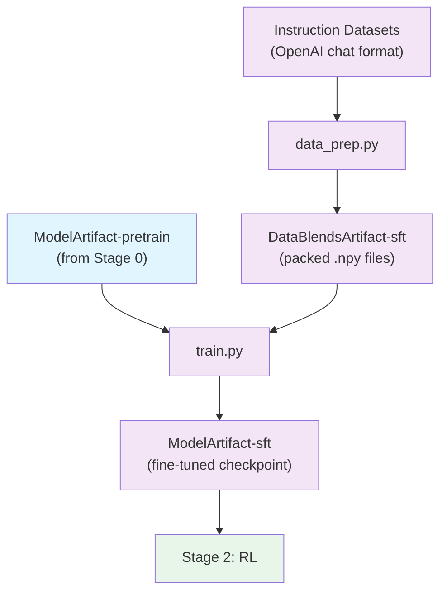

# Stage 1: Supervised Fine-Tuning (SFT)

This stage fine-tunes the pretrained model for instruction following using Megatron-Bridge.

## Overview

SFT transforms the pretrained base model into an instruction-following model. The methodology follows [Tech Report Section 3.1](https://arxiv.org/abs/2506.XXXXX), applying chat templates with role-based loss masking and training on diverse instruction-following datasets.

Compared to Nemotron Nano 2, SFT strategy has significantly improved through increased dataset quality and diversity, with emphasis on multi-step and multi-turn agentic tasks. The majority of training data is publicly released alongside this codebase.

> **Open-Source Data Only**: This recipe trains exclusively on the open-sourced subset of SFT data. Results will differ from the tech report benchmarks, which used additional proprietary data. Use this recipe as a reference implementation to apply the methodology with your own data.

| Component | Description |
|-----------|-------------|
| `data_prep.py` | Applies chat templates, tokenizes to packed .npy format |
| `train.py` | Runs supervised fine-tuning using Megatron-Bridge |
| `config/` | Configuration files for data prep and training |

## Chat Template

Nemotron 3 Nano supports both reasoning and non-reasoning modes through its chat template:

- **Multi-Step**: In a series of assistant model calls, existing reasoning tokens are preserved to allow the model to reuse reasoning for subsequent steps
- **Multi-Turn**: When a user message is introduced, reasoning from previous turns is dropped

Tool calling uses XML-style special tags to reduce character escaping, following the observations in GLM-4.5.

## SFT Data Domains

The SFT training data covers 12+ domains, each targeting specific capabilities.

### Competition Math

Mathematical reasoning using a similar strategy to Nemotron Nano 2, with responses refreshed using GPT-OSS-120B. Additionally, tool-integrated reasoning traces are created using problem tools and GPT-OSS-20B as the teacher model.

Data sources include OpenMathReasoning, Moshkov et al. (2025), Physics Big, and Zaharov et al. (2025), with problems spanning competitive mathematics, physics, chemistry, and other sciences.

### Competition Code

Competitive coding problems from six OpenCodeReasoning datasets. Solutions are generated using a reasoning model such as Qwen3-235B-A22B-Thinking-2507 with two strategies:
1. Obfuscation without visually changing the original problem
2. Complication by actually making the problem more complex

### Synthetic Cross-Domain Code (InfinityByte)

**InfinityByte** is a novel approach that cross-breeds multiple datasets to create entirely new programming problems. Starting from competitive coding problems from OpenCodeReasoning datasets across mathematics, physics, chemistry, and other sciences, InfinityByte:

1. Systematically injects concepts from disparate domains
2. Generates questions at the boundary of model capabilities
3. Mimics how science is often advanced at the intersection of two or more fields

The pipeline generates multiple problem candidates per source, selects the best using an LLM-as-critic, and generates solutions using Qwen3-235B-A22B-Thinking-2507.

### Synthetic STEM Reasoning (RQA)

The Reasoning Question-Answer (RQA) dataset reinforces complex reasoning capabilities within STEM domains. Goals:

1. Demonstrate advanced scientific reasoning and instruction following for post-training reinforcement
2. Reinforce correlations between advanced topics otherwise rarely observed in web-scale data

The dataset generation process:
1. Target diverse and advanced scientific texts from Essential-Web dataset
2. Filter using Essential-Web taxonomy to documents with undergraduate/graduate education level
3. Apply hierarchically stratified sampling to trade off document volume and diversity
4. Generate RQA samples from seed documents using contiguous text chunks (4096 characters)

### Conversational Tool Use

Synthetic multi-turn trajectories demonstrating conversational tool use. Each trajectory involves:
- A user given a task to accomplish
- An agent instructed to help the user
- A tool execution environment simulated by a language model

For general-purpose tool use scenarios, the user persona is seeded from Nemotron-Personas-USA. Trajectories are filtered using a language model judge to evaluate consistency with goals.

Data sources include Qwen3-235B-A22B-Thinking-2507, GPT-OSS-120B, Qwen3-235B-A22B-Instruct-2507.

### Long Context

Synthetic data targeting RULER task improvement, with:
- Mean token length of 128k tokens
- Hard limit of 256k tokens

### Formal Proofs

Lean theorem proving data curated through autoformalizing 580k natural language theorems from online mathematics communities (AoPS, Math StackExchange, MathOverflow).

The pipeline:
1. Run large-scale proof generation using GenSol-Prover-V2 with back-translation-based semantic verification
2. Yield 920k proof traces with compiler-verified solutions
3. After filtering, the final dataset contains 300k examples pairing formal theorem statements with successful reasoning traces and proofs

### Multilingual

Translation of existing English post-training data into 5 target languages using Qwen2.5-Instruct:
- French
- Spanish
- Italian
- German
- Japanese

The multilingual corpus comprises 1.62 million text translation samples from news-commentary datasets and proprietary sources, covering bidirectional translation tasks between English and each target language.

### Terminal Use

Tasks teaching Nemotron 3 Nano to complete terminal operations, generated from Terminal Bench. The pipeline:
1. Adopt data from coding, math, and long context datasets
2. Generate synthetic tasks requiring data analysis and file operations
3. Combine with vendor-collected terminal tasks using Qwen3-Coder-480B-A83B-Instruct and Kimi-K2-Instruct-0905

### General Chat

SFT data generated from responses to LMSYS and WildChat datasets using GPT-OSS-120B, Qwen3-235B-A22B-Thinking-2507, and Qwen3-235B-A22B-Instruct-2507. Data is extended to multi-turn by having the same language model simulate the user and continue the conversation.

### Instruction Following

Targeted instruction following data using the methodology from Tülu 3. Users are simulated in conversation using language models seeded with user personas from Nemotron-Personas-USA and instructions from IFEval and IFBench.

The generated data is filtered to keep only samples where all turns pass instruction verifier implementations.

### Safety

Diverse unsafe prompts from:
- Nemotron Content Safety v2
- Gretel Safety Alignment v1
- Red-Team-2K datasets

Safe prompt wrappers enable models to learn appropriate refusal behaviors while preserving user engagement. Various refusal strategies are implemented including applying jailbreak templates and using content safety moderation classifiers.

### Software Engineering

Dataset of coding tasks derived from real-world GitHub issues for autonomous software engineering capabilities:
- Code exploration
- Issue reproduction
- Bug fixing

Trajectories distilled from open-source agent harnesses including OpenHands, SWE-Agent, and Mini-SWE-Agent using Qwen3-Coder-480B-A83B-Instruct as the teacher model.

### Science

Physics, chemistry, and biology data produced through a unified pipeline integrating synthetic, real, and document-based seed sources. Generation pipelines implemented in NeMo Data Designer, utilizing:
- Jinja templating
- Guardrail structured outputs
- Feedback loops for data validation and automated retries

## Data Filtering

A unified data filtering pipeline ensures high-quality, license-compliant, and verifiable samples:

1. **Structural checks**: Discard malformed examples (e.g., missing tool definitions when tool calls are present)
2. **Pathological repetition filtering**: Aggressively filter reasoning traces with repeated n-grams within sliding windows or across entire trajectories
3. **Consistency filtering**: Remove trajectories where the judge considers an action inconsistent with goals
4. **Narrative filtering**: Apply keyword- and regex-based filters to remove outputs with political/nationalistic narratives (patterns like "our nation/party [...]", "our values")

## Data Mixture

Training uses over 18M total samples with dynamic sampling to achieve optimal performance in single task settings. The exact data blend is detailed in Table 5 of the tech report.

Larger datasets may be trained over for many epochs while smaller datasets are trained for only a few epochs. A dynamic sampling approach is employed where sample datasets are shuffled and domains are shuffled throughout training steps.

## Hyperparameters

| Parameter | Value |
|-----------|-------|
| **Learning Rate** | 1e-5 |
| **Batch Size** | Sequences per step (config-dependent) |
| **Sequence Length** | 4096 tokens (pack_size) |
| **Loss Masking** | Role-based (assistant tokens only) |
| **Optimizer** | AdamW |

## Quick Start

### Using nemotron CLI (Recommended)

```bash
# 1. Prepare data (apply chat templates, tokenize to .npy)
uv run nemotron nano3 data prep sft --run YOUR-CLUSTER

# 2. Run SFT
uv run nemotron nano3 sft --run YOUR-CLUSTER

# Quick test with tiny config
uv run nemotron nano3 sft -c tiny --run YOUR-CLUSTER
```

### Direct Script Execution

Inside a container on a compute node:

```bash
# Data preparation
uv run python data_prep.py --config config/data_prep.yaml

# Training (single node)
uv run python train.py --config config/tiny.yaml

# Training (distributed)
uv run torchrun --nproc_per_node=8 train.py --config config/tiny.yaml
```

## Data Preparation

The `data_prep.py` script processes OpenAI-format chat data into packed sequences with role-based loss masking.

### Pipeline

1. **Apply chat template** → Role-labeled chunks (system, user, assistant)
2. **Tokenize** → input_ids with role boundaries
3. **Build loss_mask** → 0 for system/user tokens, 1 for assistant tokens
4. **Pack sequences** → Efficient batching up to `pack_size` tokens
5. **Split by ratio** → training.npy, validation.npy, test.npy

### CLI Command

```bash
uv run nemotron nano3 data prep sft [options]
```

| Option | Description |
|--------|-------------|
| `--run <profile>` | Execute on Slurm via NeMo-Run |
| `--sample N` | Limit rows per dataset (for testing) |
| `--force` | Force re-run, ignoring cache |

### Input

OpenAI chat format datasets defined in `config/data_blend_raw.json`:

```json
{
  "datasets": [
    {
      "name": "dataset-name",
      "path": "hf-org/dataset",
      "split": "train",
      "weight": 1.0
    }
  ]
}
```

Expected record format:

```json
{
  "messages": [
    {"role": "system", "content": "You are a helpful assistant."},
    {"role": "user", "content": "Hello!"},
    {"role": "assistant", "content": "Hi there!"}
  ]
}
```

### Output

```
output/stage1_sft/
├── training.npy      # Packed training sequences
├── validation.npy    # Packed validation sequences
├── test.npy          # Packed test sequences
└── metadata.json     # Split statistics and packing info
```

Each .npy file contains packed sequences with `input_ids` and `loss_mask` arrays.

The output is registered as a W&B Artifact (`DataBlendsArtifact-sft`) for lineage tracking.

### Configuration

`config/data_prep.yaml`:

```yaml
blend_path: config/data_blend_raw.json
output_dir: output/stage1_sft
tokenizer_model: nvidia/NVIDIA-Nemotron-Nano-9B-v2
pack_size: 4096
chat_template: nano3
messages_field: messages
train_ratio: 0.98
valid_ratio: 0.01
test_ratio: 0.01
```

| Parameter | Description |
|-----------|-------------|
| `pack_size` | Maximum tokens per packed sequence |
| `chat_template` | Template name (`nano3`) or path to .jinja file |
| `messages_field` | Field containing OpenAI-format messages |
| `train_ratio` | Fraction for training split (default 0.98) |

## Training

The `train.py` script runs supervised fine-tuning using Megatron-Bridge.

### CLI Command

```bash
uv run nemotron nano3 sft [options] [overrides...]
```

| Option | Description |
|--------|-------------|
| `--run <profile>` | Attached—submits and waits, streaming logs |
| `--batch <profile>` | Detached—submits and exits immediately |
| `-c <config>` | Config file (e.g., `-c tiny` for testing) |
| `--dry-run` | Preview execution plan |
| `key=value` | Override config values (Hydra-style) |

### Input

- **Model**: Pretrained checkpoint from Stage 0 (`ModelArtifact-pretrain`)
- **Data**: `DataBlendsArtifact-sft` (from data prep)
- **Config**: `config/default.yaml` or `config/tiny.yaml`

### Output

- Fine-tuned model checkpoints
- Registered as W&B Artifact (`ModelArtifact-sft`) for downstream RL stage

### Configuration Files

| File | Purpose |
|------|---------|
| `config/default.yaml` | Production configuration |
| `config/tiny.yaml` | Testing variant |
| `config/data_blend_raw.json` | Full dataset blend |
| `config/data_blend_tiny.json` | Small blend for testing |

### Override Examples

```bash
# More training iterations
uv run nemotron nano3 sft -c tiny train.train_iters=5000

# Different learning rate
uv run nemotron nano3 sft -c tiny optimizer.lr=1e-5

# Load specific pretrained checkpoint
uv run nemotron nano3 sft -c tiny checkpoint.load=/path/to/pretrain/checkpoint

# Multiple overrides
uv run nemotron nano3 sft -c tiny \
    train.train_iters=5000 \
    optimizer.lr=1e-5 \
    checkpoint.save_interval=100
```

## Running with NeMo-Run

The nemotron CLI uses [NeMo-Run](https://github.com/NVIDIA-NeMo/Run) for job orchestration.

### env.toml Setup

Configure execution profiles in `env.toml`:

```toml
[wandb]
project = "nemotron"
entity = "YOUR-TEAM"

[YOUR-CLUSTER]
executor = "slurm"
account = "YOUR-ACCOUNT"
partition = "batch"
nodes = 2
ntasks_per_node = 8
gpus_per_node = 8
mounts = ["/lustre:/lustre"]
```

Container images are specified in recipe config files, not in env.toml.

### Execution Examples

```bash
# Attached (wait for completion, stream logs)
uv run nemotron nano3 sft -c tiny --run YOUR-CLUSTER

# Detached (submit and exit immediately)
uv run nemotron nano3 sft -c tiny --batch YOUR-CLUSTER

# Preview without executing
uv run nemotron nano3 sft -c tiny --run YOUR-CLUSTER --dry-run
```

See [nemo-run.md](../nemo-run.md) for complete configuration options.

## Artifact Lineage



## Next Steps

After SFT completes, proceed to [Stage 2: RL](./rl.md) for alignment training.

## Reference

- [Tech Report Section 3.1](https://arxiv.org/abs/2506.XXXXX) — SFT methodology
- [Stage 0: Pretraining](./pretrain.md) — Pretrain the base model
- [Recipe Source](../../../src/nemotron/recipes/nano3/stage1_sft/) — Implementation details
- [Back to Overview](./README.md)
