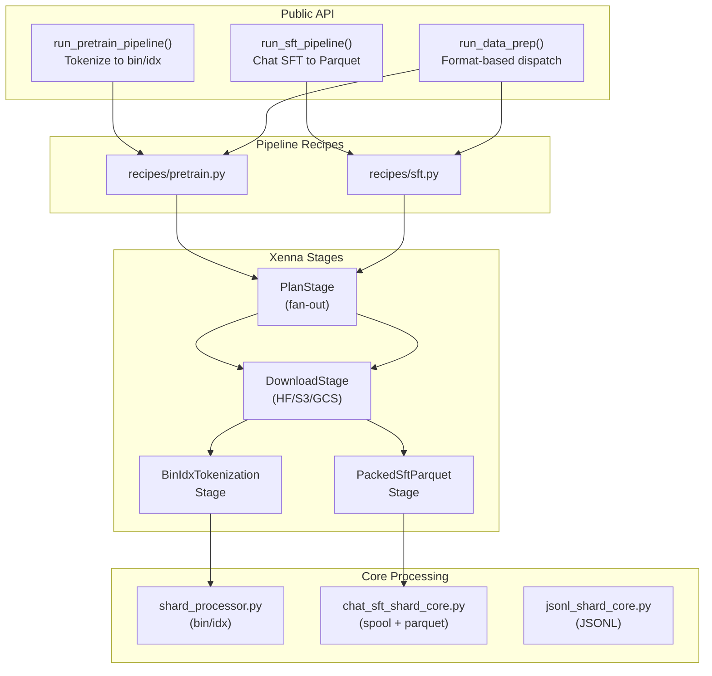

# nemotron.data_prep

Distributed data preparation for LLM training, built on cosmos-xenna pipelines.

## Overview

This module processes raw text data from HuggingFace, S3, or local sources into
training formats for Megatron-Bridge and Megatron-Core:

- **bin/idx** - Tokenized indexed datasets for pretraining
- **JSONL** - Structured records for SFT/RL (with optional transforms)
- **Packed Parquet** - Packed sequences with loss masking for Chat SFT

## Architecture



## Module Structure

```
src/nemotron/data_prep/
├── __init__.py              # Public API exports
├── api.py                   # Public facade (run_data_prep, recipe re-exports)
├── blend.py                 # DataBlend specification
├── config.py                # Configuration dataclasses
│
├── core/                    # Core processing logic
│   ├── __init__.py          # process_*_core function aliases
│   ├── chat_sft_shard_core.py # Chat SFT core processing
│   ├── chat_template.py     # Chat templating utilities
│   ├── jsonl_shard_core.py  # JSONL core processing
│   ├── planning.py          # Shard planning & assignment
│   ├── providers.py         # Tokenizer factories
│   ├── shard_processor.py   # bin/idx core processing
│   └── work_items.py        # Work item dataclasses
│
├── formats/                 # Output format builders
│   ├── __init__.py
│   ├── indexed_dataset.py   # bin/idx writer
│   ├── jsonl_dataset.py     # JSONL writer
│   └── transforms.py        # Transform factories
│
├── observability/           # Observability utilities
│   ├── __init__.py          # W&B, Prometheus, stats callbacks
│   ├── prometheus_metrics.py # Prometheus metrics scraping
│   ├── stage_keys.py        # Stage naming conventions
│   ├── stats_callback.py    # Pipeline stats callbacks
│   └── wandb_hook.py        # W&B real-time logging (plan/progress tables)
│
├── packing/                 # Sequence packing
│   ├── __init__.py
│   ├── algorithms.py        # Packing algorithms
│   ├── bin_assignment.py    # Bin assignment logic
│   ├── builder.py           # Sequence builder
│   ├── materialize.py       # Bin materialization
│   ├── spool.py             # Sequence spool I/O
│   └── writers.py           # Parquet shard writer
│
├── recipes/                 # Pipeline orchestration
│   ├── __init__.py
│   ├── pretrain.py          # run_pretrain_pipeline
│   └── sft.py               # run_sft_pipeline
│
├── stages/                  # Xenna pipeline stages
│   ├── __init__.py          # Stage exports
│   ├── context.py           # PipelineContext shared state
│   ├── download.py          # DownloadStage
│   ├── megatron_bin_idx.py  # BinIdxTokenizationStage
│   ├── packed_sft_parquet.py # PackedSftParquetStage
│   ├── plan.py              # PlanStage (pretrain)
│   └── sft_plan.py          # SftPlanStage
│
├── utils/                   # Utilities
│   ├── __init__.py
│   ├── discovery.py         # Dataset metadata fetching (HF API)
│   ├── filesystem.py        # Cloud-native file I/O (fsspec)
│   ├── hf_env.py            # HuggingFace environment
│   ├── hf_placeholder.py    # HF placeholder resolution
│   ├── size.py              # Size parsing & formatting
│   └── splits.py            # Split utilities
│
└── templates/
    └── nano3.jinja          # Nano3 chat template
```

## Quick Start

### Pretrain Pipeline (bin/idx)

```python
from nemotron.data_prep import DataBlend, run_pretrain_pipeline

blend = DataBlend.load("pretrain_blend.json")
result = run_pretrain_pipeline(
    blend=blend,
    output_dir="./output",
    tokenizer="nvidia/NVIDIA-Nemotron-Nano-9B-v2",
    num_shards=128,
)

print(f"Run hash: {result.run_hash}")
print(f"Total tokens: {result.total_tokens:,}")
```

### SFT Pipeline (Packed Parquet)

```python
from nemotron.data_prep import DataBlend, run_sft_pipeline

blend = DataBlend.load("sft_blend.json")
result = run_sft_pipeline(
    blend=blend,
    output_dir="./output",
    tokenizer="nvidia/NVIDIA-Nemotron-Nano-9B-v2",
    num_shards=64,
    chat_template="nano3",
    pack_size=4096,
)

print(f"Run hash: {result.run_hash}")
print(f"Total sequences: {result.total_sequences:,}")
```

### Format-Based Dispatch (Compatibility)

For backward compatibility with documentation examples:

```python
from nemotron.data_prep import (
    DataBlend,
    PipelineConfig,
    run_data_prep,
)
from nemotron.data_prep.config import (
    BinIdxOutputConfig,
    OutputConfig,
    TokenizerConfig,
)
from pathlib import Path

blend = DataBlend.load("blend.json")
config = PipelineConfig(
    tokenizer=TokenizerConfig(model="nvidia/NVIDIA-Nemotron-Nano-9B-v2"),
    output=OutputConfig(
        dir=Path("./output"),
        format=BinIdxOutputConfig(num_shards=64),
    ),
)

result = run_data_prep(config, blend=blend)
```

## Output Formats

| Format | Recipe | Output | Use Case |
|--------|--------|--------|----------|
| bin/idx | `run_pretrain_pipeline()` | `.bin/.idx` pairs | Pretraining |
| Packed Parquet | `run_sft_pipeline()` | `.parquet` files | Chat SFT |
| JSONL | Stage scripts | `.jsonl` files | RL training |

## Built-in Transforms

For JSONL output (via stage scripts), use transforms to convert input records:

```python
from nemotron.data_prep.formats.transforms import (
    sft,           # SFT format: {input, output}
    openai_chat,   # OpenAI format: {messages: [...]}
    sharegpt,      # ShareGPT format: {conversations: [...]}
    passthrough,   # Pass records unchanged
    select,        # Select specific fields
    rename,        # Rename fields
)
```

## Full Documentation

See [docs/train/data-prep.md](../../../docs/train/data-prep.md) for complete API reference.

## Key Design Principles

1. **Xenna-based pipelines** - Distributed processing via cosmos-xenna stages
2. **Deterministic output** - Frozen shard plans ensure reproducibility
3. **Cloud-native** - fsspec for S3/GCS/local file handling
4. **Resumable** - Skip completed shards on restart via receipts
5. **Artifact tracking** - W&B integration for lineage

## Usage in Nano3 Recipes

Each training stage uses data_prep differently:

| Stage | API | Output Format |
|-------|-----|---------------|
| Stage 0 (Pretrain) | `run_pretrain_pipeline()` | bin/idx |
| Stage 1 (SFT) | `run_sft_pipeline()` | Packed Parquet |
| Stage 2 (RL) | Stage script + `process_jsonl_shard_core()` | JSONL |

See the stage-specific `data_prep.py` files in `nemotron/recipes/nano3/` for examples.
