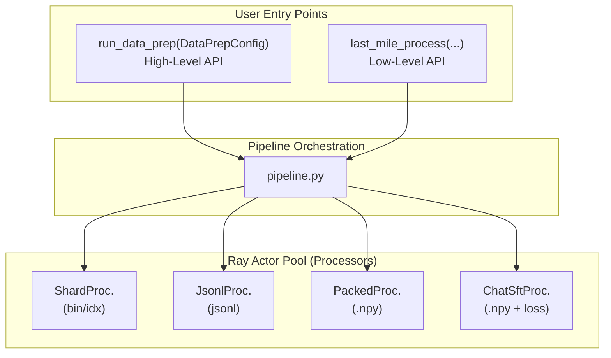

# nemotron.data_prep

Distributed data preparation for LLM training, built on Ray.

## Overview

This module processes raw text data from HuggingFace, S3, or local sources into
training formats for Megatron-Bridge and Megatron-Core:

- **bin/idx** - Tokenized indexed datasets for pretraining
- **JSONL** - Structured records for SFT/RL (with optional transforms)
- **Packed .npy** - Packed sequences for efficient SFT training
- **Chat SFT** - Packed sequences with role-based loss masking

## Architecture



## Module Structure

```
src/nemotron/data_prep/
├── __init__.py           # Public API exports
├── __main__.py           # CLI entry point
├── cli.py                # CLI commands (run, status, verify)
├── config.py             # Configuration dataclasses
├── pipeline.py           # Pipeline orchestration
├── planning.py           # Shard planning & assignment
├── discovery.py          # Dataset metadata fetching
├── providers.py          # Tokenizer factories
├── blend.py              # DataBlend specification
├── formats/
│   ├── transforms.py     # Transform factories (sft, openai_chat, etc.)
│   ├── indexed_dataset.py# bin/idx writer
│   └── jsonl_dataset.py  # JSONL writer
├── shard_processor.py    # bin/idx Ray actor
├── jsonl_processor.py    # JSONL Ray actor
├── packed_processor.py   # Packed .npy Ray actor
├── chat_sft_processor.py # Chat SFT Ray actor
├── chat_template.py      # Chat templating utilities
├── filesystem.py         # Cloud-native file I/O (fsspec)
└── console.py            # Rich terminal UI
```

## Quick Start

### High-Level API (Tokenization)

For simple tokenization to bin/idx format:

```python
from nemotron.data_prep import DataPrepConfig, run_data_prep
from pathlib import Path

config = DataPrepConfig(
    blend_path=Path("data_blend.json"),
    output_dir=Path("./output"),
    tokenizer_model="nvidia/NVIDIA-Nemotron-Nano-9B-v2",
)
artifact = run_data_prep(config)
```

### Low-Level API (Custom Formats)

For more control over output format:

```python
from nemotron.data_prep import last_mile_process, DataBlend, PipelineConfig
from nemotron.data_prep.config import OutputConfig, JsonlOutputConfig
from nemotron.data_prep.formats.transforms import sft

blend = DataBlend.load("data_blend.json")
config = PipelineConfig(
    output=OutputConfig(
        dir=Path("./sft_data"),
        format=JsonlOutputConfig(
            transform=sft(input="instruction", output="response"),
        ),
    ),
)
result = last_mile_process(blend, config)
```

## CLI Usage

```bash
# Run tokenization
python -m nemotron.data_prep run config.yaml ./output

# Check pipeline status
python -m nemotron.data_prep status ./output

# Verify output integrity
python -m nemotron.data_prep verify ./output <run-hash>
```

## Output Formats

| Format | Config Class | Output | Use Case |
|--------|--------------|--------|----------|
| bin/idx | `BinIdxOutputConfig` | `.bin/.idx` pairs | Pretraining |
| JSONL | `JsonlOutputConfig` | `.jsonl` files | SFT/RL with transforms |
| Packed | `PackedOutputConfig` | `.npy` files | Efficient SFT |
| Chat SFT | `ChatSftOutputConfig` | `.npy` + loss masks | SFT with chat templates |

## Built-in Transforms

For JSONL output, use transforms to convert input records:

```python
from nemotron.data_prep.formats.transforms import (
    sft,           # SFT format: {input, output}
    openai_chat,   # OpenAI format: {messages: [...]}
    sharegpt,      # ShareGPT format: {conversations: [...]}
    nemotron_rl,   # RL format for Nemotron training
    passthrough,   # Pass records unchanged
    select,        # Select specific fields
    rename,        # Rename fields
)
```

## Full Documentation

See [docs/train/data-prep.md](../../../docs/train/data-prep.md) for complete API reference including:

- All configuration options
- Transform factory details
- Sharding configuration
- Per-split output
- Compression options
- Type definitions

## Key Design Principles

1. **Ray-based parallelism** - Distributed processing via long-lived actors
2. **Deterministic output** - Frozen shard plans ensure reproducibility
3. **Cloud-native** - fsspec for S3/GCS/local file handling
4. **Resumable** - Skip completed shards on restart
5. **Artifact tracking** - W&B integration for lineage

## Usage in Nano3 Recipes

Each training stage uses data_prep differently:

| Stage | API | Output Format | Config |
|-------|-----|---------------|--------|
| Stage 0 (Pretrain) | `run_data_prep()` | bin/idx | `PerSplitConfig` |
| Stage 1 (SFT) | `last_mile_process()` | Chat SFT .npy | `ChatSftOutputConfig` |
| Stage 2 (RL) | `last_mile_process()` | JSONL | `JsonlOutputConfig` |

See the stage-specific `data_prep.py` files for implementation examples.
