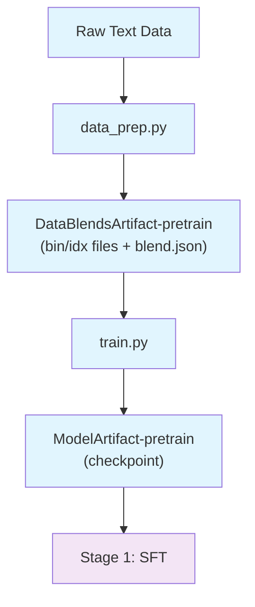

# Stage 0: Pretraining

Pretrain Nemotron Nano 3 on a large text corpus using Megatron-Bridge.

## Overview

This stage tokenizes raw text data and trains the base language model from scratch. It produces a pretrained checkpoint that serves as the foundation for subsequent instruction tuning (SFT) and alignment (RL) stages.

> **Open-Source Data Only**: This recipe trains exclusively on the open-sourced subset of pretraining data. Results will differ from the tech report benchmarks, which used additional proprietary data. Use this recipe as a reference implementation to apply the methodology with your own data.

| Component | Description |
|-----------|-------------|
| `data_prep.py` | Tokenizes raw text into Megatron bin/idx format |
| `train.py` | Runs pretraining using Megatron-Bridge |
| `config/` | Configuration files for data prep and training |

## Quick Start

### Using nemotron CLI (Recommended)

```bash
# 1. Prepare data (tokenize to bin/idx format)
uv run nemotron nano3 data prep pretrain --run YOUR-CLUSTER

# 2. Run pretraining
uv run nemotron nano3 pretrain --run YOUR-CLUSTER

# Quick test with tiny config
uv run nemotron nano3 pretrain -c tiny --run YOUR-CLUSTER
```

### Direct Script Execution

Inside a container on a compute node:

```bash
# Data preparation
python data_prep.py --config config/data_prep.yaml

# Training (single node)
python train.py --config config/tiny.yaml

# Training (distributed)
torchrun --nproc_per_node=8 train.py --config config/tiny.yaml
```

## Data Preparation

The `data_prep.py` script tokenizes raw text datasets into Megatron's binary format.

### CLI Command

```bash
uv run nemotron nano3 data prep pretrain [options]
```

| Option | Description |
|--------|-------------|
| `--run <profile>` | Execute on Slurm via NeMo-Run |
| `--sample N` | Limit rows per dataset (for testing) |
| `--force` | Force re-run, ignoring cache |

### Input

Dataset blend defined in `config/data_blend_raw.json`:

```json
{
  "datasets": [
    {"name": "dataset-name", "weight": 1.0, "split": "train"},
    ...
  ]
}
```

### Output

```
output/nano3/stage0_pretrain/
├── train/
│   ├── data_00000.bin
│   ├── data_00000.idx
│   └── ...
├── valid/
│   └── ...
├── test/
│   └── ...
└── blend.json          # Per-split data paths for Megatron-Bridge
```

The output is registered as a W&B Artifact (`DataBlendsArtifact-pretrain`) for lineage tracking.

### Configuration

`config/data_prep.yaml`:

```yaml
blend_path: config/data_blend_raw.json
output_dir: output/nano3/stage0_pretrain
num_shards: 128
tokenizer_model: nvidia/NVIDIA-Nemotron-Nano-9B-v2
add_bos: false
add_eos: true
```

## Training

The `train.py` script runs pretraining using Megatron-Bridge.

### CLI Command

```bash
uv run nemotron nano3 pretrain [options] [overrides...]
```

| Option | Description |
|--------|-------------|
| `--run <profile>` | Attached execution on Slurm |
| `--batch <profile>` | Detached execution (submit and exit) |
| `-c <config>` | Config file (e.g., `-c tiny` for testing) |
| `--dry-run` | Preview execution plan |
| `key=value` | Override config values (Hydra-style) |

### Input

- **Data**: `DataBlendsArtifact-pretrain` (from data prep)
- **Config**: `config/default.yaml` or `config/tiny.yaml`

### Output

- Model checkpoints saved to configured `checkpoint.save` path
- Registered as W&B Artifact for downstream stages

### Configuration Files

| File | Purpose |
|------|---------|
| `config/default.yaml` | Production configuration |
| `config/tiny.yaml` | Testing (small model, 1700 iterations) |
| `config/data_blend_raw.json` | Full dataset blend |
| `config/data_blend_raw_small.json` | Small blend (math-only) for testing |

#### config/tiny.yaml

```yaml
run:
  data: DataBlendsArtifact-pretrain:latest

recipe:
  _target_: megatron.bridge.recipes.qwen.qwen3.qwen3_8b_pretrain_config
  per_split_data_args_path: ${art:data,path}/blend.json

train:
  train_iters: 1700
  global_batch_size: 32

scheduler:
  lr_warmup_iters: 32

logger:
  log_interval: 10
  wandb_project: ${run.wandb.project}
  wandb_entity: ${run.wandb.entity}

checkpoint:
  save: /nemo_run/pretrain
  save_interval: 20
```

### Override Examples

```bash
# More training iterations
uv run nemotron nano3 pretrain -c tiny train.train_iters=5000

# Larger batch size
uv run nemotron nano3 pretrain -c tiny train.global_batch_size=64

# Different checkpoint location
uv run nemotron nano3 pretrain -c tiny checkpoint.save=/path/to/checkpoints
```

## Running with NeMo-Run

The nemotron CLI uses [NeMo-Run](https://github.com/NVIDIA-NeMo/Run) for job orchestration.

### env.toml Setup

Configure execution profiles in `env.toml`:

```toml
[wandb]
project = "nemotron"
entity = "YOUR-TEAM"

[YOUR-CLUSTER]
executor = "slurm"
account = "YOUR-ACCOUNT"
partition = "batch"
nodes = 2
ntasks_per_node = 8
gpus_per_node = 8
mounts = ["/lustre:/lustre"]
```

> **Note**: Container images are specified in the recipe config files (e.g., `config/tiny.yaml`), not in env.toml.

### Execution Modes

```bash
# Attached (wait for completion)
uv run nemotron nano3 pretrain -c tiny --run YOUR-CLUSTER

# Detached (submit and exit)
uv run nemotron nano3 pretrain -c tiny --batch YOUR-CLUSTER

# Preview without executing
uv run nemotron nano3 pretrain -c tiny --run YOUR-CLUSTER --dry-run
```

See [docs/train/nemo-run.md](../../../../docs/train/nemo-run.md) for complete configuration options.

## Artifact Lineage



## Next Steps

After pretraining completes, proceed to [Stage 1: SFT](../stage1_sft/README.md) for instruction tuning.
