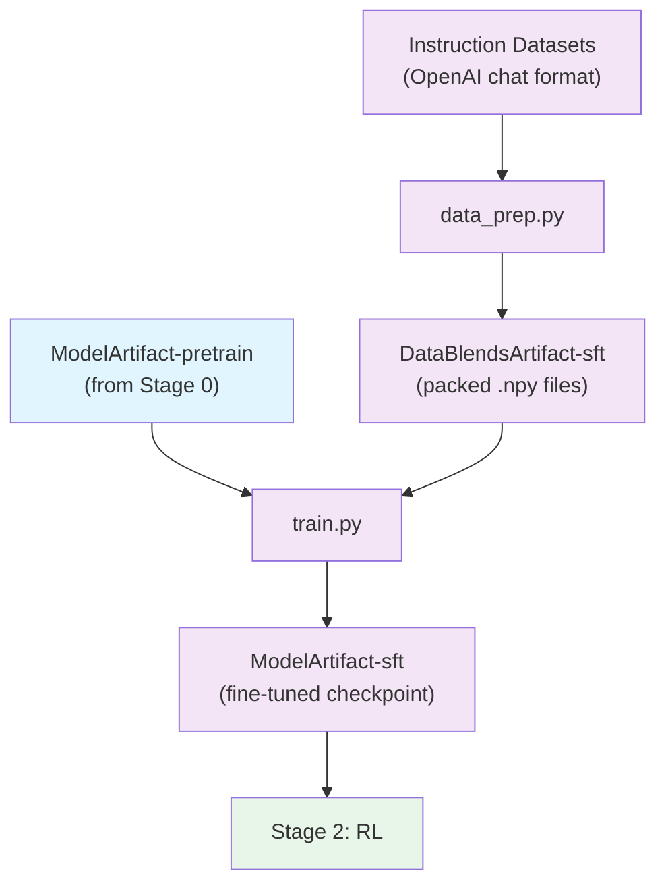

# Stage 1: Supervised Fine-Tuning (SFT)

Fine-tune the pretrained model to follow instructions using Megatron-Bridge.

## Overview

This stage takes instruction-following datasets in OpenAI chat format, applies chat templates with role-based loss masking, and fine-tunes the pretrained model. The output is an instruction-following model ready for alignment training.

> **Open-Source Data Only**: This recipe trains exclusively on the open-sourced subset of SFT data. Results will differ from the tech report benchmarks, which used additional proprietary data. Use this recipe as a reference implementation to apply the methodology with your own data.

| Component | Description |
|-----------|-------------|
| `data_prep.py` | Applies chat templates, tokenizes to packed .npy format |
| `train.py` | Runs supervised fine-tuning using Megatron-Bridge |
| `config/` | Configuration files for data prep and training |

## Quick Start

### Using nemotron CLI (Recommended)

```bash
# 1. Prepare data (apply chat templates, tokenize to .npy)
uv run nemotron nano3 data prep sft --run YOUR-CLUSTER

# 2. Run SFT
uv run nemotron nano3 sft --run YOUR-CLUSTER

# Quick test with tiny config
uv run nemotron nano3 sft -c tiny --run YOUR-CLUSTER
```

### Direct Script Execution

Inside a container on a compute node:

```bash
# Data preparation
python data_prep.py --config config/data_prep.yaml

# Training (single node)
python train.py --config config/tiny.yaml

# Training (distributed)
torchrun --nproc_per_node=8 train.py --config config/tiny.yaml
```

## Data Preparation

The `data_prep.py` script processes OpenAI-format chat data into packed sequences with role-based loss masking.

### Pipeline

1. **Apply chat template** → Role-labeled chunks (system, user, assistant)
2. **Tokenize** → input_ids with role boundaries
3. **Build loss_mask** → 0 for system/user tokens, 1 for assistant tokens
4. **Pack sequences** → Efficient batching up to `pack_size` tokens
5. **Split by ratio** → training.npy, validation.npy, test.npy

### CLI Command

```bash
uv run nemotron nano3 data prep sft [options]
```

| Option | Description |
|--------|-------------|
| `--run <profile>` | Execute on Slurm via NeMo-Run |
| `--sample N` | Limit rows per dataset (for testing) |
| `--force` | Force re-run, ignoring cache |

### Input

OpenAI chat format datasets defined in `config/data_blend_raw.json`:

```json
{
  "datasets": [
    {
      "name": "dataset-name",
      "path": "hf-org/dataset",
      "split": "train",
      "weight": 1.0
    }
  ]
}
```

Expected record format:

```json
{
  "messages": [
    {"role": "system", "content": "You are a helpful assistant."},
    {"role": "user", "content": "Hello!"},
    {"role": "assistant", "content": "Hi there!"}
  ]
}
```

### Output

```
output/stage1_sft/
├── training.npy      # Packed training sequences
├── validation.npy    # Packed validation sequences
├── test.npy          # Packed test sequences
└── metadata.json     # Split statistics and packing info
```

Each .npy file contains packed sequences with `input_ids` and `loss_mask` arrays.

The output is registered as a W&B Artifact (`DataBlendsArtifact-sft`) for lineage tracking.

### Configuration

`config/data_prep.yaml`:

```yaml
blend_path: config/data_blend_raw.json
output_dir: output/stage1_sft
tokenizer_model: nvidia/NVIDIA-Nemotron-Nano-9B-v2
pack_size: 4096
chat_template: nano3
messages_field: messages
train_ratio: 0.98
valid_ratio: 0.01
test_ratio: 0.01
```

| Parameter | Description |
|-----------|-------------|
| `pack_size` | Maximum tokens per packed sequence |
| `chat_template` | Template name (`nano3`) or path to .jinja file |
| `messages_field` | Field containing OpenAI-format messages |
| `train_ratio` | Fraction for training split (default 0.98) |

## Training

The `train.py` script runs supervised fine-tuning using Megatron-Bridge.

### CLI Command

```bash
uv run nemotron nano3 sft [options] [overrides...]
```

| Option | Description |
|--------|-------------|
| `--run <profile>` | Attached execution on Slurm |
| `--batch <profile>` | Detached execution (submit and exit) |
| `-c <config>` | Config file (e.g., `-c tiny` for testing) |
| `--dry-run` | Preview execution plan |
| `key=value` | Override config values (Hydra-style) |

### Input

- **Model**: Pretrained checkpoint from Stage 0 (`ModelArtifact-pretrain`)
- **Data**: `DataBlendsArtifact-sft` (from data prep)
- **Config**: `config/default.yaml` or `config/tiny.yaml`

### Output

- Fine-tuned model checkpoints
- Registered as W&B Artifact (`ModelArtifact-sft`) for downstream RL stage

### Configuration Files

| File | Purpose |
|------|---------|
| `config/default.yaml` | Production configuration |
| `config/tiny.yaml` | Testing variant |
| `config/data_blend_raw.json` | Full dataset blend |
| `config/data_blend_tiny.json` | Small blend for testing |

### Override Examples

```bash
# More training iterations
uv run nemotron nano3 sft -c tiny train.train_iters=5000

# Different learning rate
uv run nemotron nano3 sft -c tiny optimizer.lr=1e-5

# Load specific pretrained checkpoint
uv run nemotron nano3 sft -c tiny checkpoint.load=/path/to/pretrain/checkpoint
```

## Running with NeMo-Run

The nemotron CLI uses [NeMo-Run](https://github.com/NVIDIA-NeMo/Run) for job orchestration.

### env.toml Setup

Configure execution profiles in `env.toml`:

```toml
[wandb]
project = "nemotron"
entity = "YOUR-TEAM"

[YOUR-CLUSTER]
executor = "slurm"
account = "YOUR-ACCOUNT"
partition = "batch"
nodes = 2
ntasks_per_node = 8
gpus_per_node = 8
mounts = ["/lustre:/lustre"]
```

> **Note**: Container images are specified in the recipe config files (e.g., `config/tiny.yaml`), not in env.toml.

### Execution Modes

```bash
# Attached (wait for completion)
uv run nemotron nano3 sft -c tiny --run YOUR-CLUSTER

# Detached (submit and exit)
uv run nemotron nano3 sft -c tiny --batch YOUR-CLUSTER

# Preview without executing
uv run nemotron nano3 sft -c tiny --run YOUR-CLUSTER --dry-run
```

See [docs/train/nemo-run.md](../../../../docs/train/nemo-run.md) for complete configuration options.

## Artifact Lineage



## Next Steps

After SFT completes, proceed to [Stage 2: RL](../stage2_rl/README.md) for alignment training.

## Previous Stage

- [Stage 0: Pretraining](../stage0_pretrain/README.md) - Pretrain the base model
