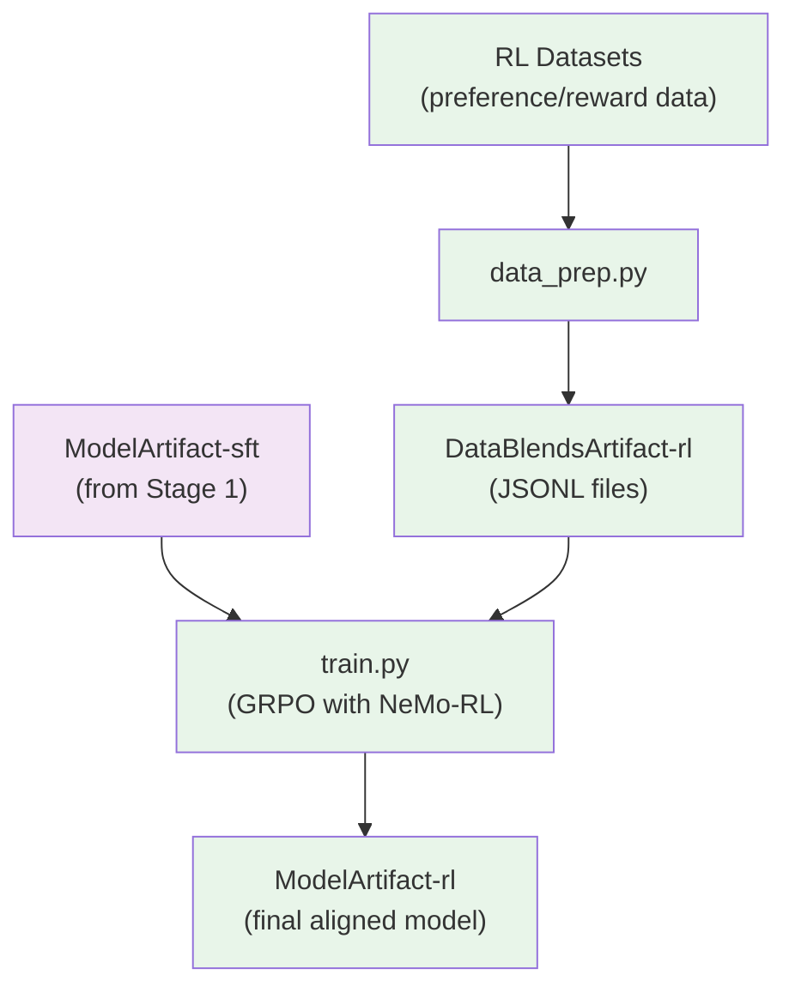

# Stage 2: Reinforcement Learning (RL)

Align the instruction-tuned model using GRPO (Group Relative Policy Optimization) with NeMo-RL.

## Overview

This stage takes the SFT model and further aligns it using reinforcement learning. The GRPO algorithm optimizes the policy based on reward signals from NeMo-Gym environments, producing a final aligned model.

> **Open-Source Data Only**: This recipe trains exclusively on the open-sourced subset of RL data. Results will differ from the tech report benchmarks, which used additional proprietary data. Use this recipe as a reference implementation to apply the methodology with your own data.

| Component | Description |
|-----------|-------------|
| `data_prep.py` | Converts datasets to JSONL format for NeMo-RL |
| `train.py` | Runs GRPO training using NeMo-RL with Ray |
| `config/` | Configuration files for data prep and training |

## Quick Start

### Using nemotron CLI (Recommended)

```bash
# 1. Prepare data (convert to JSONL format)
uv run nemotron nano3 data prep rl --run YOUR-CLUSTER

# 2. Run RL training
uv run nemotron nano3 rl --run YOUR-CLUSTER

# Quick test with tiny config
uv run nemotron nano3 rl -c tiny --run YOUR-CLUSTER
```

### Direct Script Execution

Inside a container on a compute node (requires NeMo-RL and Ray):

```bash
# Data preparation
python data_prep.py --config config/data_prep.yaml

# Training (Ray will be initialized internally)
python train.py --config config/grpo_nanov3.yaml
```

## Data Preparation

The `data_prep.py` script converts datasets to JSONL format compatible with NeMo-RL's NeMo-Gym interface.

### CLI Command

```bash
uv run nemotron nano3 data prep rl [options]
```

| Option | Description |
|--------|-------------|
| `--run <profile>` | Execute on Slurm via NeMo-Run |
| `--sample N` | Limit rows per dataset (for testing) |
| `--force` | Force re-run, ignoring cache |

### Input

RL datasets defined in `config/data_blend_raw.json`. The data is transformed using the `nemotron_rl` transform which extracts from `responses_create_params.input`.

### Output

```
output/nano3/stage2_rl/
├── train/
│   └── data.jsonl       # Training data in NeMo-Gym format
├── val/
│   └── data.jsonl       # Validation data
├── test/
│   └── data.jsonl       # Test data
└── manifest.json        # Split paths and ratios
```

The output is registered as a W&B Artifact (`DataBlendsArtifact-rl`) for lineage tracking.

### Configuration

`config/data_prep.yaml`:

```yaml
blend_path: config/data_blend_raw.json
output_dir: output/nano3/stage2_rl
shard_size: 256MB
split_output: train_val_test
train_ratio: 0.98
val_ratio: 0.01
```

| Parameter | Description |
|-----------|-------------|
| `split_output` | `train_val_test` for separate splits, `none` for single output |
| `train_ratio` | Fraction for training split (default 0.98) |
| `val_ratio` | Fraction for validation split (default 0.01) |

## Training

The `train.py` script runs GRPO training using NeMo-RL with Ray for distributed execution.

### CLI Command

```bash
uv run nemotron nano3 rl [options] [overrides...]
```

| Option | Description |
|--------|-------------|
| `--run <profile>` | Attached execution on Slurm |
| `--batch <profile>` | Detached execution (submit and exit) |
| `-c <config>` | Config file (e.g., `-c tiny` for testing) |
| `--dry-run` | Preview execution plan |
| `key=value` | Override config values (Hydra-style) |

### Input

- **Model**: SFT checkpoint from Stage 1 (`ModelArtifact-sft`)
- **Data**: `DataBlendsArtifact-rl` (from data prep)
- **Config**: `config/grpo_nanov3.yaml` or `config/tiny.yaml`

### Output

- Aligned model checkpoints
- Training logs and metrics
- Registered as W&B Artifact (`ModelArtifact-rl`)

### Configuration Files

| File | Purpose |
|------|---------|
| `config/grpo_nanov3.yaml` | Production GRPO configuration |
| `config/tiny.yaml` | Testing variant |
| `config/data_blend_raw.json` | RL dataset blend (6 datasets) |

### Key Configuration Sections

```yaml
policy:
  model_name: "path/to/sft/checkpoint"
  tokenizer: "nvidia/NVIDIA-Nemotron-Nano-9B-v2"
  generation:
    temperature: 0.7
    max_new_tokens: 1024

grpo:
  num_iterations: 100
  batch_size: 32
  learning_rate: 1e-6

data:
  train_jsonl_fpath: "/path/to/train/data.jsonl"
  validation_jsonl_fpath: "/path/to/val/data.jsonl"

env:
  nemo_gym:
    # NeMo-Gym environment configuration
```

### Override Examples

```bash
# More iterations
uv run nemotron nano3 rl -c tiny grpo.num_iterations=200

# Different temperature
uv run nemotron nano3 rl -c tiny policy.generation.temperature=0.8

# Different learning rate
uv run nemotron nano3 rl -c tiny grpo.learning_rate=5e-7
```

## Running with NeMo-Run

The nemotron CLI uses [NeMo-Run](https://github.com/NVIDIA-NeMo/Run) for job orchestration. RL training uses Ray internally for distributed execution.

### env.toml Setup

Configure execution profiles in `env.toml`:

```toml
[wandb]
project = "nemotron"
entity = "YOUR-TEAM"

[YOUR-CLUSTER]
executor = "slurm"
account = "YOUR-ACCOUNT"
partition = "batch"
nodes = 2
ntasks_per_node = 8
gpus_per_node = 8
mem = "0"
exclusive = true
mounts = ["/lustre:/lustre"]
```

> **Note**: Container images are specified in the recipe config files (e.g., `config/tiny.yaml`), not in env.toml.

### Execution Modes

```bash
# Attached (wait for completion)
uv run nemotron nano3 rl -c tiny --run YOUR-CLUSTER

# Detached (submit and exit)
uv run nemotron nano3 rl -c tiny --batch YOUR-CLUSTER

# Preview without executing
uv run nemotron nano3 rl -c tiny --run YOUR-CLUSTER --dry-run
```

See [docs/train/nemo-run.md](../../../../docs/train/nemo-run.md) for complete configuration options.

## GRPO Algorithm

GRPO (Group Relative Policy Optimization) is a reinforcement learning algorithm that:

1. **Generates responses** from the current policy
2. **Evaluates** responses using NeMo-Gym reward environments
3. **Computes group-relative advantages** across response groups
4. **Updates the policy** to favor higher-reward responses

Key features:
- Efficient batched generation and evaluation
- Ray-based distributed training
- Integration with NeMo-Gym for flexible reward computation

## Artifact Lineage



## Requirements

- **NeMo-RL**: Required for GRPO training
- **Ray**: Automatically initialized for distributed execution
- **NeMo-Gym**: Provides reward environments
- **GPU nodes**: Recommended 8 GPUs per node

## Previous Stages

- [Stage 0: Pretraining](../stage0_pretrain/README.md) - Pretrain the base model
- [Stage 1: SFT](../stage1_sft/README.md) - Instruction tuning
